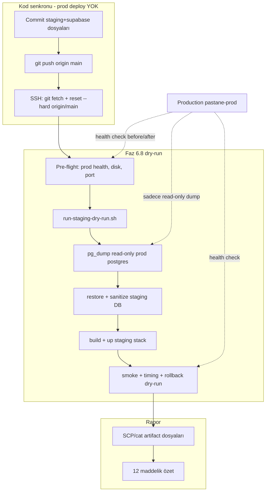

# VPS Gerçek Production Dump Staging Dry-Run Planı

## Kritik kısıtlar (değişmez)

| Yapılacak | Yapılmayacak |
|-----------|--------------|
| SSH ile kod senkronu (git pull) | `./deploy.sh` / `pnpm push:vps` |
| Staging compose up/down | [`docker/docker-compose.prod.yml`](docker/docker-compose.prod.yml) değişikliği |
| Read-only `pg_dump` | Production container stop/restart |
| `.env.staging` oluşturma | [`.env.production`](.env.production) değişikliği |
| Loopback portları (`31xx`, `55432`) | Nginx / canlı domain değişikliği |



---

## Faz 0 — Ön koşul: VPS kod senkronu (deploy YOK)

**Durum:** Local `main` üzerinde Faz 6.5/6.8 dosyaları **commit edilmemiş** (`scripts/staging/`, `docker/docker-compose.staging.yml`, `supabase/`, `schema.prisma` `directUrl`, vb.). VPS eski kodda — dry-run script’leri yok.

**Strateji:** Scoped commit + push + VPS’te **yalnızca** `git pull` (hard reset). **`deploy.sh` çalıştırılmayacak** — prod image rebuild/restart olmaz.

### Commit kapsamı (Supabase migration + staging dry-run)

Minimum dosya seti:

- [`scripts/staging/*`](scripts/staging/) (+ [`_load-env.sh`](scripts/staging/_load-env.sh))
- [`docker/docker-compose.staging.yml`](docker/docker-compose.staging.yml), [`docker/docker-compose.supabase.staging.yml`](docker/docker-compose.supabase.staging.yml)
- [`docker/docker-compose.supabase.prod.yml`](docker/docker-compose.supabase.prod.yml), [`docker/docker-compose.prod.cutover.yml`](docker/docker-compose.prod.cutover.yml) (Faz 6.5 — prod’a dokunulmaz, sadece repo)
- [`.env.staging.example`](.env.staging.example), [`.env.production.cutover.example`](.env.production.cutover.example)
- [`packages/database/schema.prisma`](packages/database/schema.prisma) + migrations + seed/script değişiklikleri
- [`supabase/config.toml`](supabase/config.toml)
- [`scripts/backup-prod.sh`](scripts/backup-prod.sh), [`scripts/restore-prod.sh`](scripts/restore-prod.sh) güncellemeleri
- [`package.json`](package.json) staging script’leri
- İlgili dokümanlar: [`docs/supabase-staging-dry-run-faz-6.8.md`](docs/supabase-staging-dry-run-faz-6.8.md), [`docs/supabase-vps-cutover-plan-faz-6.5.md`](docs/supabase-vps-cutover-plan-faz-6.5.md)

**Not:** Commit için **açık onayınız gerekir** (user rule). Onay sonrası agent scoped commit + push yapar.

### VPS sync komutu (deploy.sh DEĞİL)

[`scripts/deploy-vps.env.local`](scripts/deploy-vps.env.local) üzerinden SSH:

```bash
ssh deploy@$VPS_HOST "cd /var/www/pastane-app/app && \
  git fetch origin main && \
  git reset --hard origin/main && \
  git log -1 --oneline"
```

`.env.production` gitignore’da — **VPS prod secret’ları etkilenmez**.

---

## Faz 1 — VPS tek seferlik staging env

SSH ile VPS’te:

```bash
cd /var/www/pastane-app/app
cp .env.staging.example .env.staging
chmod 600 .env.staging
mkdir -p /var/backups/pastane-staging
```

**Doldurulması zorunlu** ([`run-staging-dry-run.sh`](scripts/staging/run-staging-dry-run.sh) satır 35–49):

- `STAGING_POSTGRES_PASSWORD` / `POSTGRES_PASSWORD`
- `REDIS_PASSWORD`
- `JWT_SECRET`, `JWT_REFRESH_SECRET` (min 32 char, **prod’dan farklı**)
- `MINIO_SECRET_KEY`

VPS değerleri:

```bash
BACKUP_DIR=/var/backups/pastane-staging
STAGING_TIMING_REPORT=/var/backups/pastane-staging/cutover-timing-report.json
```

**pgAdmin (`STAGING_PGADMIN_PASSWORD=change_me_*`) opsiyonel** — script artık zorunlu kontrol etmiyor.

---

## Faz 2 — Pre-flight (prod’a dokunmadan)

VPS’te sırayla:

1. **Prod health (baseline):**
   ```bash
   curl -sf https://api.azem.cloud/health | head -c 200
   docker compose --project-name pastane-prod --env-file .env.production \
     -f docker/docker-compose.prod.yml ps
   ```

2. **Disk:** dump + restore + Docker build için en az **2× prod DB boyutu + 2 GB** boş alan
   ```bash
   df -h / /var/lib/docker /var/backups
   ```

3. **Port çakışması:** `3100–3103`, `55432`, `9100` loopback’te boş olmalı
   ```bash
   ss -tlnp | grep -E '3100|3101|3102|3103|55432|9100' || echo "ports free"
   ```

4. **Staging script varlığı:**
   ```bash
   test -x scripts/staging/run-staging-dry-run.sh && echo OK
   ```

Herhangi bir pre-flight FAIL → **dry-run başlatma**, production’a dokunma, hatayı raporla, onay bekle.

---

## Faz 3 — Dry-run çalıştırma

VPS’te (tahmini süre: **30–60 dk** — ilk Docker build + gerçek prod dump restore):

```bash
cd /var/www/pastane-app/app
bash scripts/staging/run-staging-dry-run.sh 2>&1 | tee /var/backups/pastane-staging/dry-run-$(date -u +%Y%m%dT%H%M%SZ).log
```

Script akışı ([`run-staging-dry-run.sh`](scripts/staging/run-staging-dry-run.sh)):

| Adım | İşlem | Prod etkisi |
|------|--------|-------------|
| A | Resource snapshot (before) | Yok |
| B | `supabase-staging` DB up | Yok |
| C | Read-only `pg_dump` via prod `postgres` container | **Sadece okuma** |
| D | `pg_restore` + sanitize + staging passwords | Yok |
| E | Staging app Docker build | Yok |
| F | Staging stack up (`31xx`) | Yok |
| G | Prisma migrate status | Yok |
| H | [`smoke-staging.sh`](scripts/staging/smoke-staging.sh) | Yok |
| I | [`measure-cutover-timing.sh`](scripts/staging/measure-cutover-timing.sh) | Yok |
| J | Resource snapshot (after) | Yok |
| K | [`rollback-dry-run.sh`](scripts/staging/rollback-dry-run.sh) — staging down + prod health | Yok |

**Hata durumunda:** script `set -e` ile durur → staging stack’i manuel down et (gerekirse), prod health tekrar kontrol, **Faz 7’ye geçme**, düzeltme öner + onay bekle.

---

## Faz 4 — Artifact toplama ve 12 maddelik rapor

VPS’ten okunacak dosyalar:

| Artifact | Yol |
|----------|-----|
| Timing JSON | `/var/backups/pastane-staging/cutover-timing-report.json` |
| Resource snapshot | `/var/backups/pastane-staging/resource-snapshot.txt` |
| Restore timing | `/var/backups/pastane-staging/last-restore-timing.txt` |
| Dump pointer | `/var/backups/pastane-staging/.latest-prod-source-dump` |
| Full log | `/var/backups/pastane-staging/dry-run-*.log` |

Local’e kopya (agent):

```bash
scp deploy@$VPS_HOST:/var/backups/pastane-staging/cutover-timing-report.json tmp/
scp deploy@$VPS_HOST:/var/backups/pastane-staging/resource-snapshot.txt tmp/
scp deploy@$VPS_HOST:/var/backups/pastane-staging/last-restore-timing.txt tmp/ 2>/dev/null || true
```

### Rapor şablonu (agent dolduracak)

1. **Dry-run başarılı mı?** — exit code + log son satır
2. **Production dump boyutu** — `ls -lh` latest dump
3. **Restore + sanitize süresi** — `last-restore-timing.txt` / timing JSON `pgRestoreAndSanitize`
4. **Prisma migrate süresi** — timing JSON `prismaMigrateDeploy`
5. **Staging API startup süresi** — timing JSON `stagingAppStartup`
6. **Smoke testler** — log’daki OK/FAIL satırları
7. **Rollback dry-run** — [`rollback-dry-run.sh`](scripts/staging/rollback-dry-run.sh) çıktısı + prod health HTTP code
8. **RAM/CPU/disk** — `resource-snapshot.txt` before/after özeti
9. **Production olumsuz etki** — pre/post `docker stats pastane-prod`, prod health, prod `ps` uptime karşılaştırması
10. **`cutover-timing-report.json` özeti** — JSON alanları
11. **`resource-snapshot.txt` özeti** — host free/disk + staging container MemUsage
12. **Faz 7 güvenli mi?** — tüm smoke yeşil + prod etkilenmedi + restore süresi maintenance window’a sığıyorsa **EVET**; aksi **HAYIR** + blokör listesi

Local WSL referans (145 KB dump, ~1 s restore) **VPS prod için geçerli değil** — doc tahmini: restore **15–25 dk**.

---

## Faz 7 güven kararı kriterleri

| Kriter | Geçiş şartı |
|--------|-------------|
| Smoke 9/9 | Tümü OK |
| Prod health | Before/after HTTP 200 |
| Prod container uptime | Restart yok |
| Restore süresi | Ölçülen süre + 40 dk buffer ≤ planlanan maintenance |
| Rollback dry-run | Staging down, prod healthy |
| Hata | Herhangi biri FAIL → **Faz 7’ye geçme** |

---

## Bilinen riskler ve mitigasyon

| Risk | Mitigasyon |
|------|------------|
| VPS’te script yok | Faz 0 git sync (deploy.sh yok) |
| `pg_dump` prod IO spike | Düşük trafik saati; read-only, kısa süreli |
| Disk dolması | Pre-flight `df -h` |
| İlk staging build uzun | Normal; timing’e `stagingAppBuildFirstTime` notu |
| Smoke login fail | `set-staging-passwords.sh` + sanitize telefonları (`905559000001` vb.) |
| Yanlışlıkla prod deploy | **`push:vps` ve `./deploy.sh` kullanma** |

---

## Agent execution sırası (onay sonrası)

1. Scoped commit için onay al → commit + push
2. SSH pre-flight (prod health, disk, ports)
3. VPS `.env.staging` yoksa oluştur / doğrula (secret’lar VPS’te manuel veya güvenli kanalla)
4. `bash scripts/staging/run-staging-dry-run.sh` çalıştır (log tee)
5. Artifact’ları topla
6. 12 maddelik raporu sun
7. Hata varsa: prod’a dokunma, analiz + düzeltme öner, tekrar denemeden önce onay bekle
