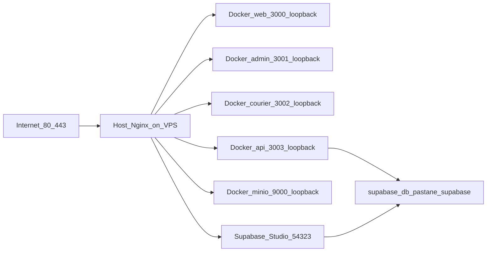

# Production operations (Host Nginx + Docker Compose)

## Architecture (Supabase + app stacks)



**Two Docker Compose projects on the VPS:**

| Project         | Compose file                                                          | Services                                  |
| --------------- | --------------------------------------------------------------------- | ----------------------------------------- |
| `supabase-prod` | [`docker/supabase/`](../docker/supabase/) + Pastane overrides         | Full Supabase stack (db, studio, kong, …) |
| `pastane-prod`  | [`docker/docker-compose.prod.yml`](../docker/docker-compose.prod.yml) | api, web, admin, courier, redis, minio    |

- **PostgreSQL (production):** `supabase-db` on network `pastane_supabase` — **no** host port publish.
- **Studio:** https://studio.azem.cloud → Supabase Studio on `127.0.0.1:54323` (Kong / Supavisor not exposed on host ports).
- **Compose layers:** `docker/supabase/docker-compose.yml` + `docker-compose.pg17.yml` + `docker-compose.pastane.prod.yml`.

Deploy helper: [`deploy.sh`](../deploy.sh) — ensures **supabase-prod** full stack, then app pull/up (`--no-build`), migrate, health + smoke.

Shared compose helpers: [`scripts/lib/compose-prod.sh`](../scripts/lib/compose-prod.sh).

- **Redis:** Docker internal network only (`pastane_internal`).
- **MinIO S3 API:** `127.0.0.1:9000` for Host Nginx `storage.azem.cloud`.
- Legacy `pull --ff-only` behaviour: `DEPLOY_NO_HARD_RESET=1 ./deploy.sh`.

## Routine deploy on VPS

Önerilen günlük akış, geliştirici makinesinden yalnızca git push yapmaktır. GitHub Actions image build/push ve VPS deploy adımlarını tamamlar.

```bash
pnpm push:vps           # typecheck -> git push -> GitHub Actions deploy
pnpm push:vps:fast      # typecheck atlanır
```

Registry tabanlı ayrıntılar: [github-actions-registry-deploy.md](./github-actions-registry-deploy.md)

Sunucuda doğrudan manuel fallback:

```bash
cd /var/www/pastane-app/app
./deploy.sh
```

Deploy sonunda otomatik:

- `scripts/post-deploy-health.sh` (loopback `http://127.0.0.1:3003/health`)
- `scripts/post-deploy-smoke-prod.sh` (read-only `/api/v1/products`)

After Host Nginx + TLS:

```bash
curl -fsS https://api.azem.cloud/health
PROD_API_URL=https://api.azem.cloud bash scripts/post-deploy-smoke-prod.sh
```

## Logs

App stack:

```bash
docker compose --project-name pastane-prod --env-file .env.production \
  -f docker/docker-compose.prod.yml logs --tail=200 api
```

Supabase stack:

```bash
bash scripts/generate-supabase-compose-env.sh .env.production
docker compose --project-name supabase-prod --env-file docker/supabase/.runtime.env \
  -f docker/supabase/docker-compose.yml \
  -f docker/supabase/docker-compose.pg17.yml \
  -f docker/supabase/docker-compose.pastane.prod.yml logs --tail=100 db
```

## Database migrations

Production uses **`prisma migrate deploy` only**, invoked from `deploy.sh`. Requires **`DIRECT_URL`** pointing at `supabase-db`. Do **not** run `prisma migrate dev` on production.

## Studio (Supabase Dashboard)

```bash
bash scripts/setup-studio-vps.sh
```

URL: https://studio.azem.cloud — login via `DASHBOARD_USERNAME` / `DASHBOARD_PASSWORD`.

### Supabase env (`.env.production`)

| Variable                                          | Purpose                                      |
| ------------------------------------------------- | -------------------------------------------- |
| `JWT_SECRET`                                      | Pastane API only — do not reuse for Supabase |
| `SUPABASE_JWT_SECRET`                             | Supabase stack internal JWT                  |
| `SUPABASE_ANON_KEY` / `SUPABASE_SERVICE_ROLE_KEY` | Supabase API keys (HS256)                    |
| `DASHBOARD_USERNAME` / `DASHBOARD_PASSWORD`       | Studio login                                 |
| `SUPABASE_PUBLIC_URL`                             | `https://studio.azem.cloud`                  |
| `POSTGRES_*` / `DATABASE_URL`                     | Prisma → `pastane_db` @ `supabase-db`        |

```bash
bash scripts/generate-supabase-secrets.sh
bash scripts/generate-supabase-compose-env.sh .env.production
```

Full list: [`.env.production.example`](../.env.production.example). Pin / upgrade notes: [`docker/supabase/README.pastane.md`](../docker/supabase/README.pastane.md).

### Local → VPS data sync

When local Supabase CLI + MinIO are the source of truth:

```bash
bash scripts/sync-local-to-vps.sh
bash scripts/sync-local-to-vps-verify.sh
```

### Disaster recovery

1. **App rollback:** [`ROLLBACK_GUIDE.md`](ROLLBACK_GUIDE.md) — previous `IMAGE_TAG`.
2. **Database:** [`backup-and-restore.md`](backup-and-restore.md) + `scripts/restore-prod.sh`.
3. **New VPS / full stack rebuild:** generate secrets → `.env.production` → `CONFIRM=YES bash scripts/cutover-full-supabase-prod.sh` (fresh init + restore from dump).

Legacy plain Postgres and pgAdmin were removed; do not reintroduce them.

### Upgrade upstream Supabase

1. Re-vendor `docker/supabase/` from a **tagged** release.
2. Test locally with Supabase CLI.
3. Backup → `docker compose pull` → `up -d` → smoke on VPS.

## Backups

Default target is **supabase-db**:

```bash
bash scripts/backup-prod.sh
```

See [`scripts/backup-prod.sh`](../scripts/backup-prod.sh), [`docs/backup-and-restore.md`](backup-and-restore.md), [`docs/azem-cloud-vps-deployment.md`](azem-cloud-vps-deployment.md).

## Rollback

- **App images:** [`docs/ROLLBACK_GUIDE.md`](ROLLBACK_GUIDE.md) — registry pull + `IMAGE_TAG` via `scripts/rollback-prod.sh`
- **Database:** [`docs/backup-and-restore.md`](backup-and-restore.md) — dump restore via `scripts/restore-prod.sh`

## Post-deploy checklist

- [ ] `https://api.azem.cloud/health` → `"status":"ok"`
- [ ] `GET /api/v1/products?limit=1` → 200
- [ ] `docker compose ... ps` — api + supabase-db healthy
- [ ] `prisma migrate status` — no pending migrations
- [ ] Recent backup in `BACKUP_DIR` (< 24h)
- [ ] https://studio.azem.cloud shows Supabase Studio (Table Editor lists `public` tables)
- [ ] Kong port 8000 not reachable from the internet
