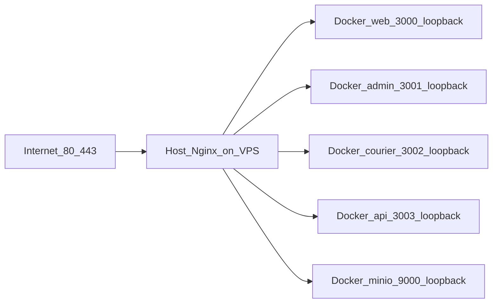

# Production operations (Host Nginx + Docker Compose)

## Architecture



- **PostgreSQL, Redis**: Docker internal network only (`pastane_internal`); **no** host port publish.
- **MinIO S3 API**: `127.0.0.1:9000` for Host Nginx `storage.azem.cloud` (compose publishes loopback-only).

Compose file: [`docker/docker-compose.prod.yml`](../docker/docker-compose.prod.yml)  
Deploy helper: [`deploy.sh`](../deploy.sh) — `git pull`, `docker compose build`, `up -d`, `prisma migrate deploy`.

## Routine deploy on VPS

```bash
cd /var/www/pastane-app/app
./deploy.sh
curl -fsS http://127.0.0.1:3003/health
```

After Host Nginx + TLS:

```bash
curl -fsS https://api.azem.cloud/health
```

## Logs

```bash
docker compose --project-name pastane-prod --env-file .env.production \
  -f docker/docker-compose.prod.yml logs --tail=200 api
```

## Database migrations

Production uses **`prisma migrate deploy` only**, invoked from `deploy.sh`. Do **not** run `prisma migrate dev` on production.

## Backups

See [`backup-db.sh`](../backup-db.sh) and [`docs/azem-cloud-vps-deployment.md`](azem-cloud-vps-deployment.md).
