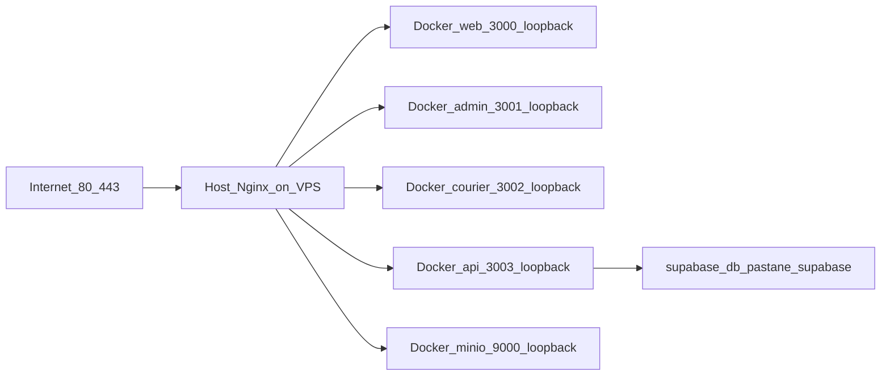

# Production operations (Host Nginx + Docker Compose)

## Architecture (post Faz 7 — Supabase DB)



**Two Docker Compose projects on the VPS:**

| Project | Compose file | Services |
|---------|--------------|----------|
| `supabase-prod` | [`docker/docker-compose.supabase.prod.yml`](../docker/docker-compose.supabase.prod.yml) | `supabase-db` (+ optional `studio` profile) |
| `pastane-prod` | [`docker/docker-compose.prod.yml`](../docker/docker-compose.prod.yml) | api, web, admin, courier, redis, minio |

- **PostgreSQL (production):** `supabase-db` on external network `pastane_supabase` — **no** host port publish.
- **Legacy postgres:** profile `legacy-db` in app compose — **rollback window only** (~7 days after cutover). See [`supabase-legacy-rollback-window.md`](supabase-legacy-rollback-window.md).
- **Redis:** Docker internal network only (`pastane_internal`).
- **MinIO S3 API:** `127.0.0.1:9000` for Host Nginx `storage.azem.cloud`.

Deploy helper: [`deploy.sh`](../deploy.sh) — syncs `main` to **`origin/main`**, ensures **supabase-db** is up, `docker compose build`, `up -d`, `prisma migrate deploy` (via `DIRECT_URL`), then **post-deploy health + smoke**. Legacy `pull --ff-only` behaviour: `DEPLOY_NO_HARD_RESET=1 ./deploy.sh`.

Shared compose helpers: [`scripts/lib/compose-prod.sh`](../scripts/lib/compose-prod.sh).

## Routine deploy on VPS

From your dev machine (**`main`**, temiz çalışma ağacı, `scripts/deploy-vps.env.local` içinde **`VPS_HOST`**):

```bash
pnpm push:vps           # typecheck → git push → SSH ile sunucuda ./deploy.sh
pnpm push:vps:fast      # typecheck atlanır (önce `pnpm typecheck` çalıştırdıysanız)
```

Şablon: [`scripts/deploy-vps.env.example`](../scripts/deploy-vps.env.example).

Sunucuda doğrudan:

```bash
cd /var/www/pastane-app/app
./deploy.sh
```

Deploy sonunda otomatik:

- `scripts/post-deploy-health.sh` (loopback `http://127.0.0.1:3003/health`)
- `scripts/post-deploy-smoke-prod.sh` (read-only `/api/v1/products`)

After Host Nginx + TLS:

```bash
curl -fsS https://api.azem.cloud/health
PROD_API_URL=https://api.azem.cloud bash scripts/post-deploy-smoke-prod.sh
```

## Logs

App stack:

```bash
docker compose --project-name pastane-prod --env-file .env.production \
  -f docker/docker-compose.prod.yml logs --tail=200 api
```

Supabase DB:

```bash
docker compose --project-name supabase-prod --env-file .env.production \
  -f docker/docker-compose.supabase.prod.yml logs --tail=100 supabase-db
```

## Database migrations

Production uses **`prisma migrate deploy` only**, invoked from `deploy.sh`. Requires **`DIRECT_URL`** pointing at `supabase-db`. Do **not** run `prisma migrate dev` on production.

## Backups

Default target is **supabase-db**:

```bash
bash scripts/backup-prod.sh
```

Legacy postgres (rollback window only):

```bash
DB_SERVICE=postgres bash scripts/backup-prod.sh
```

See [`scripts/backup-prod.sh`](../scripts/backup-prod.sh), [`docs/backup-and-restore.md`](backup-and-restore.md), [`docs/azem-cloud-vps-deployment.md`](azem-cloud-vps-deployment.md).

## Rollback

- **App images:** [`docs/ROLLBACK_GUIDE.md`](ROLLBACK_GUIDE.md) — `IMAGE_TAG` via `scripts/rollback-prod.sh`
- **Database (legacy):** [`docs/supabase-legacy-rollback-window.md`](supabase-legacy-rollback-window.md) — 7-day window only

## Post-deploy checklist

- [ ] `https://api.azem.cloud/health` → `"status":"ok"`
- [ ] `GET /api/v1/products?limit=1` → 200
- [ ] `docker compose ... ps` — api + supabase-db healthy
- [ ] `prisma migrate status` — no pending migrations
- [ ] Recent backup in `BACKUP_DIR` (< 24h)
- [ ] Legacy postgres intentionally stopped after rollback window ends
