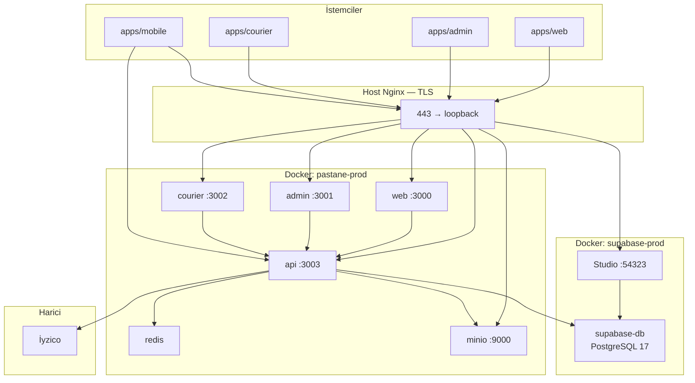
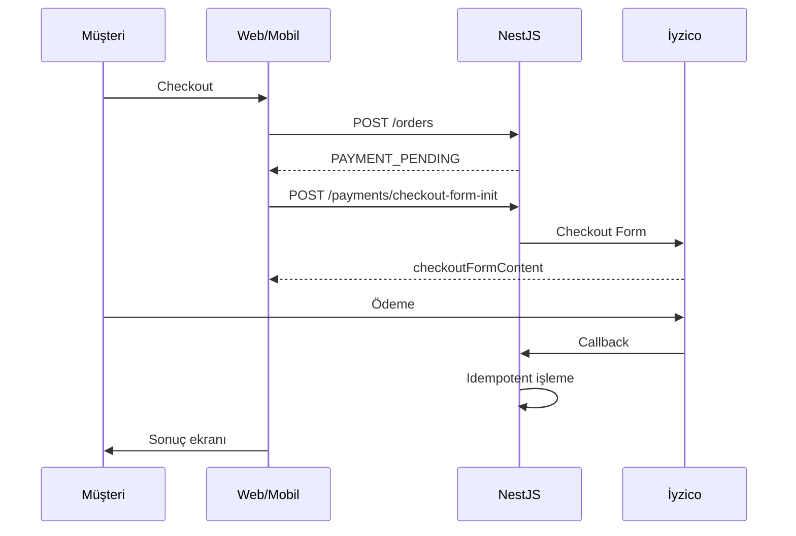

# Pastane Platform — Teknik Dokümantasyon

| Alan | Değer |
|------|--------|
| **Proje** | Pastane Platform (tek kiracılı pastane e-ticaret + operasyon) |
| **Depo** | Monorepo — pnpm 10 + Turborepo 2 |
| **Node** | 22 LTS (`>=22 <23`) |
| **Son güncelleme** | Mayıs 2026 |
| **Canlı ortam** | azem.cloud (VPS, Docker Compose + Host Nginx) |

Bu belge projenin **güncel teknik durumunu** tek kaynaktan anlatır. Günlük operasyon için [`OPERATIONS.md`](./OPERATIONS.md); agent onboarding için [`AI_HANDOFF_CONTEXT.md`](./AI_HANDOFF_CONTEXT.md); belge indeksi için [`README.md`](./README.md).

---

## İçindekiler

1. [Yönetici özeti](#1-yönetici-özeti)
2. [Canlı ortam ve URL’ler](#2-canlı-ortam-ve-urller)
3. [Mimari](#3-mimari)
4. [Monorepo yapısı](#4-monorepo-yapısı)
5. [Teknoloji yığını](#5-teknoloji-yığını)
6. [Uygulamalar](#6-uygulamalar)
7. [Paylaşılan paketler](#7-paylaşılan-paketler)
8. [Backend API](#8-backend-api)
9. [Veritabanı (Prisma)](#9-veritabanı-prisma)
10. [Kimlik doğrulama ve yetkilendirme](#10-kimlik-doğrulama-ve-yetkilendirme)
11. [İş kuralları](#11-iş-kuralları)
12. [Ödeme (İyzico)](#12-ödeme-iyzico)
13. [Frontend uygulamaları](#13-frontend-uygulamaları)
14. [Mobil uygulama (Expo)](#14-mobil-uygulama-expo)
15. [Harici entegrasyonlar](#15-harici-entegrasyonlar)
16. [Geliştirme ortamı](#16-geliştirme-ortamı)
17. [Komut referansı](#17-komut-referansı)
18. [Docker ve dağıtım](#18-docker-ve-dağıtım)
19. [Production (VPS)](#19-production-vps)
20. [Test ve kalite](#20-test-ve-kalite)
21. [Kod standartları](#21-kod-standartları)
22. [Proje durumu](#22-proje-durumu)
23. [Ortam değişkenleri](#23-ortam-değişkenleri)
24. [Dokümantasyon indeksi](#24-dokümantasyon-indeksi)

---

## 1. Yönetici özeti

Pastane Platform, **tek bir pastane işletmesi** için uçtan uca dijital altyapı sağlar:

- Müşteri vitrini (web + mobil iskelet)
- Admin operasyon paneli
- Kurye teslimat paneli
- Ortak NestJS REST API
- PostgreSQL 17 (production), Redis, MinIO, BullMQ

**SaaS / multi-tenant değildir.** Kiracı soyutlaması eklenmemelidir.

**Temel prensipler:**

| Prensip | Açıklama |
|---------|----------|
| Backend otoritesi | Fiyat, stok görünürlüğü, sipariş durumu, sadakat — sunucuda hesaplanır |
| Tek API | Tüm istemciler `/api/v1` kullanır |
| BFF + cookie | Web/admin/kurye: httpOnly cookie; access token JS’e sızmaz |
| Polling | Kritik akışlarda WebSocket yok; optimistic update yok |
| Mobil ayrı pipeline | Expo EAS ile build; VPS Docker’a deploy edilmez |

---

## 2. Canlı ortam ve URL’ler

| Servis | URL | Backend port (loopback) |
|--------|-----|-------------------------|
| Müşteri vitrini | https://azem.cloud | 3000 |
| API | https://api.azem.cloud | 3003 |
| Admin | https://admin.azem.cloud | 3001 |
| Kurye | https://courier.azem.cloud | 3002 |
| MinIO (S3) | https://storage.azem.cloud | 9000 |
| Supabase Studio | https://studio.azem.cloud | 54323 |

**VPS:** Ubuntu 24.04, Docker Compose, Host Nginx TLS sonlandırma. Uygulama kodu `/var/www/pastane-app/app`.

**Deploy:** `main` dalından `pnpm push:vps` → sunucuda `./deploy.sh`.

---

## 3. Mimari

### 3.1 Production (VPS)



**İki ayrı Compose projesi:**

| Proje | İçerik |
|-------|--------|
| `supabase-prod` | Resmi Supabase Docker yığını (PG 17, Studio, Kong, Auth, …). Pastane yalnızca PostgreSQL kullanır. |
| `pastane-prod` | api, web, admin, courier, redis, minio |

API veritabanına Docker ağı üzerinden `supabase-db` host alias’ı ile bağlanır. PostgreSQL, Redis ve MinIO **WAN’a açılmaz**.

### 3.2 İstek akışı (web / admin / kurye)

1. Tarayıcı → Next.js BFF (`app/api/*`)
2. BFF → NestJS API (sunucu tarafı, session cookie)
3. API → Prisma / Redis / MinIO / BullMQ

Mobil: doğrudan `EXPO_PUBLIC_API_URL` üzerinden API (native fetch).

---

## 4. Monorepo yapısı

```
Pastane/
├── apps/
│   ├── api/              # NestJS backend
│   ├── web/              # Müşteri Next.js (:3000)
│   ├── admin/            # Admin Next.js (:3001)
│   ├── courier/          # Kurye Next.js (:3002)
│   ├── mobile/           # Expo + React Native
│   ├── web-e2e/          # Playwright
│   ├── admin-e2e/
│   └── courier-e2e/
├── packages/
│   ├── database/         # Prisma schema, migrations, seed
│   ├── tr-api-errors/    # API errorCode → Türkçe mesaj
│   ├── types/            # Paylaşılan API tipleri
│   ├── constants/
│   ├── ui/
│   └── config/
├── docker/
│   ├── docker-compose.dev.yml
│   ├── docker-compose.prod.yml
│   ├── docker-compose.supabase.prod.yml
│   ├── supabase/         # Vendored Supabase stack + Pastane overrides
│   └── Dockerfile.*
├── deploy/nginx/         # Host Nginx config
├── docs/
├── scripts/              # Deploy, backup, sync, Supabase helpers
├── deploy.sh             # VPS production deploy
├── package.json
├── pnpm-workspace.yaml
└── turbo.json
```

Admin, courier ve web **ayrı Next.js uygulamalarıdır**; tek uygulama altında birleştirilmez.

---

## 5. Teknoloji yığını

| Katman | Teknoloji |
|--------|-----------|
| Runtime | Node.js 22 LTS |
| Dil | TypeScript (strict) |
| Backend | NestJS 11 |
| ORM | Prisma 6 |
| Veritabanı (prod) | PostgreSQL 17 — Supabase self-host |
| Veritabanı (local) | Docker PG 16 **veya** Supabase CLI PG 17 |
| Cache / kuyruk | Redis 7 + BullMQ |
| Nesne depolama | MinIO (S3 uyumlu) |
| Web | Next.js 15 App Router, React 19, Tailwind |
| Form | react-hook-form + zod |
| Mobil | Expo SDK 56, Expo Router, React Native 0.85 |
| Ödeme | İyzico Checkout Form |
| Container | Docker Compose |
| CI/CD | GitHub Actions → VPS SSH |

---

## 6. Uygulamalar

### 6.1 `apps/api` — Backend

| Özellik | Değer |
|---------|--------|
| Paket | `@pastane/api` |
| Port | 3003 |
| Prefix | `/api/v1` |
| Health | `GET /health` (prefix dışı) |
| Swagger | `/api/docs` (`SWAGGER_ENABLED=true`, prod’da kapalı) |

**Modüller:** auth, users, roles, permissions, otp, categories, products, product-units, allergens, media, banners, stores, delivery-zones, cart, orders, payments, couriers, deliveries, addresses, reviews, loyalty, notifications, campaigns, settings, reports, audit, jobs (BullMQ), health, prisma.

**Global guard sırası:** RateLimit → JWT → Roles → Permissions.

### 6.2 `apps/web` — Müşteri vitrini

| Port | 3000 |
| Router | App Router, Türkçe URL’ler |

**Ana rotalar:** `/`, `/shop`, `/kategori/[slug]`, `/urun/[slug]`, `/sepet`, `/odeme`, `/giris`, `/kayit`, `/adresler`, `/hesabim`, `/siparisler`, `/siparisler/[id]`.

**Özellikler:** banner carousel, katalog, sepet/checkout, İyzico ödeme, sipariş takibi, yorum, sadakat entegrasyonu.

### 6.3 `apps/admin` — Operasyon paneli

| Port | 3001 |
| Roller | ADMIN, ORDER_OPERATOR, PRODUCT_MANAGER |

**Modüller:** dashboard, katalog (ürün/kategori/alerjen/birim), banner CMS, kampanyalar, sadakat, mağaza/teslimat bölgeleri, siparişler, kurye atama ve kurye hesap yönetimi, yorum moderasyonu, raporlar, kullanıcılar, rol/izin (salt okunur), ayarlar, bildirim gönderimi, audit.

### 6.4 `apps/courier` — Kurye paneli

| Port | 3002 |
| Rol | COURIER zorunlu |

**Akışlar:** atanan teslimat listesi (gruplu), detay, pickup, deliver, fail (sebep zorunlu). Polling ~15 sn. Optimistic update yok.

### 6.5 `apps/mobile` — Expo

| Paket | `cloud.azem.pastahane` |
| API | `https://api.azem.cloud` (build-time) |
| Durum | Phase 7 iskelet + temel akışlar; Play Store hazırlığı devam |

Detay: [`MOBILE-PHASED-PLAN.md`](./MOBILE-PHASED-PLAN.md), [`apps/mobile/README.md`](../apps/mobile/README.md).

---

## 7. Paylaşılan paketler

| Paket | Amaç |
|-------|------|
| `@pastane/database` | [`schema.prisma`](../packages/database/schema.prisma), migrations, seed |
| `@pastane/tr-api-errors` | `errorCode` → Türkçe UI mesajı |
| `@pastane/types` | `ApiSuccessResponse`, `ApiErrorResponse` |
| `@pastane/constants` | Sabitler |
| `@pastane/ui` | Paylaşılan UI (genişletilebilir) |
| `@pastane/config` | Paylaşılan config |

**Prisma komutları:**

```bash
pnpm prisma:generate
pnpm --filter @pastane/database prisma:migrate:dev
pnpm --filter @pastane/database prisma:migrate:deploy   # production
pnpm --filter @pastane/database prisma:seed
```

---

## 8. Backend API

### 8.1 Yanıt sözleşmesi

**Başarı:**

```json
{
  "success": true,
  "data": {},
  "meta": { "page": 1, "limit": 20, "total": 100, "totalPages": 5 }
}
```

**Hata:**

```json
{
  "success": false,
  "statusCode": 400,
  "message": "Human readable message",
  "errorCode": "VALIDATION_FAILED",
  "errors": [{ "field": "email", "message": "..." }]
}
```

Liste uçları sayfalı yanıt döner (`data` + `meta`). İstemci tarafında toplam fiyat veya sipariş durumu **hesaplanmaz**; backend otoritesidir.

### 8.2 Kuyruk işleri (BullMQ)

| Job | Amaç |
|-----|------|
| Ödeme zaman aşımı | `PAYMENT_TIMEOUT_MS` sonrası sipariş iptali |
| Bildirim gönderimi | FCM/SMS/e-posta placeholder |
| Stok rezervasyonu | Timeout ve finalize |

Redis bağlantısı `REDIS_HOST` / `REDIS_PASSWORD` ile yapılandırılır.

### 8.3 Medya

- Ürün görselleri: MinIO bucket `product-images` (varsayılan)
- Banner medya: bucket `banners` (görsel + MP4/WebM)
- Upload: API üzerinden MIME/boyut doğrulaması

---

## 9. Veritabanı (Prisma)

**38 model** — [`packages/database/schema.prisma`](../packages/database/schema.prisma)

| Grup | Modeller |
|------|----------|
| Kimlik | User, Role, Permission, RolePermission, RefreshToken, OtpCode |
| Adres | Address |
| Katalog | Category, Product, ProductUnit, ProductImage, Allergen, ProductAllergen, ProductOptionGroup, ProductOption, Banner |
| Mağaza | Store, DeliveryZone |
| Sepet | Cart, CartItem, CartItemOption |
| Sipariş | Order, OrderItem, OrderItemOption, OrderStatusHistory |
| Ödeme | Payment |
| Teslimat | Courier, Delivery |
| Sadakat | LoyaltyAccount, LoyaltyMovement, LoyaltySetting |
| Diğer | Review, Notification, Campaign, Setting, AuditLog |

### Migration geçmişi

| Migration | Konu |
|-----------|------|
| `20260517182508_phase1_backend_core` | Temel şema |
| `20260517184123_phase2_catalog_stock` | Katalog |
| `20260517221500_phase3_order_payment_flow` | Sipariş / ödeme |
| `20260519143000_banners` | Banner CMS |
| `20260520120000_address_map_coordinates` | Adres koordinatları |
| `20260520140000_order_delivery_failed` | Teslimat başarısız |
| `20260520180000_remove_stock_add_product_publication` | Stok tabloları kaldırıldı; yayın penceresi |
| `20260523120000_product_units` | Satış birimleri |

Production’da yalnızca `prisma migrate deploy` (`deploy.sh` içinde). `migrate dev` production’da **çalıştırılmaz**.

### Seed (geliştirme)

[`packages/database/prisma/seed.ts`](../packages/database/prisma/seed.ts):

| Rol | Örnek e-posta |
|-----|----------------|
| Admin | `admin@pastane.com` |
| Operatör | `operator@pastane.com` |
| Ürün yöneticisi | `product@pastane.com` |
| Kurye | `kurye1@pastane.com` |
| Müşteri | `musteri@pastane.com` |

Şifreler seed dosyasında — **yalnızca dev**.

---

## 10. Kimlik doğrulama ve yetkilendirme

### 10.1 JWT

| Token | Süre | Saklama |
|-------|------|---------|
| Access | ~15 dk | Web: httpOnly cookie (BFF); Mobil: SecureStore |
| Refresh | ~30 gün | Hash’lenmiş DB (`RefreshToken`) |

Access payload: `sub`, `phone`, `role`, `permissions[]`.

**Önemli:** `JWT_SECRET` (Pastane API) ile `SUPABASE_JWT_SECRET` (Supabase stack) **farklıdır**.

### 10.2 Guard’lar

1. `@Public()` — JWT atlanır
2. `@Roles(...)` — rol kontrolü
3. `@Permissions('code')` — izin kodu (authoritative)

Frontend menü izinleri yalnızca UX; karar backend’dedir.

### 10.3 Rol tipleri (`RoleType`)

| Rol | Arayüz |
|-----|--------|
| `ADMIN` | Admin |
| `ORDER_OPERATOR` | Admin |
| `PRODUCT_MANAGER` | Admin |
| `COURIER` | Courier |
| `CUSTOMER` | Web / Mobil |

İzin kodu formatı: `module.action` (ör. `products.view`, `orders.assignCourier`, `banners.reorder`).

---

## 11. İş kuralları

### 11.1 Ürün satışa açıklığı

Ürün satın alınabilir olması için: `status=ACTIVE`, `isPublished=true`, silinmemiş, satış saat penceresi içinde (Europe/Istanbul). Mantık: [`product-availability.util.ts`](../apps/api/src/products/product-availability.util.ts).

### 11.2 Sipariş durum makinesi

```
NEW → PAYMENT_PENDING → CONFIRMED → PREPARING → READY
  → ASSIGNED_TO_COURIER → OUT_FOR_DELIVERY → DELIVERED
```

Alternatif: `DELIVERY_FAILED`, `CANCELLED`

### 11.3 Teslimat

| Tip | Gereksinim |
|-----|------------|
| `HOME_DELIVERY` | Kayıtlı adres + teslimat bölgesi |
| `PICKUP` | Aktif mağaza |

### 11.4 Sepet ve checkout

- Kullanıcı başına tek sepet
- Fiyat sunucuda hesaplanır (indirim + seçenek farkları)
- Checkout öncesi `validate-checkout`
- Kritik mutasyonlardan sonra authoritative refetch (optimistic update yok)

### 11.5 Sadakat

QR ile müşteri tanıma, puan kazanma/harcama, checkout’ta puan kullanımı (ayar aktifse).

### 11.6 Yorumlar

Teslim edilmiş sipariş kalemi için müşteri yorumu; admin onay/red.

---

## 12. Ödeme (İyzico)



- **Dev bypass:** `PAYMENT_DEV_AUTO_SUCCESS=true` (yalnızca `NODE_ENV !== production`)
- **Timeout:** BullMQ worker, `PAYMENT_TIMEOUT_MS` (varsayılan 600000 ms)
- Detay: [`iyzico_sandbox_entegrasyon_v3_web.md`](./iyzico_sandbox_entegrasyon_v3_web.md)

---

## 13. Frontend uygulamaları

### 13.1 Ortak desenler

| Desen | Açıklama |
|-------|----------|
| BFF proxy | `app/api/*` — cookie session |
| Hata eşleme | `@pastane/tr-api-errors` |
| Validasyon | zod şemaları |
| Polling | Admin siparişler, kurye, müşteri takip — [`adr-polling-strategy.md`](./adr-polling-strategy.md) |

### 13.2 API URL çözümlemesi

| Değişken | Kullanım |
|----------|----------|
| `WEB_API_URL` / `ADMIN_API_URL` / `COURIER_API_URL` | Docker içi: `http://api:3003` |
| `API_URL` | Host geliştirme fallback |
| `RUNNING_IN_DOCKER=1` | Container hostname mantığı |

---

## 14. Mobil uygulama (Expo)

```
apps/mobile/
├── app/           # Expo Router
│   ├── (tabs)/    # home, products, cart, orders, account
│   ├── checkout.tsx, payment-result.tsx
│   └── orders/[id].tsx
├── src/api/       # Client + auth refresh
├── app.config.ts
└── eas.json
```

| Özellik | Durum |
|---------|--------|
| Vitrin, sepet, auth, adres, sipariş, İyzico WebView | ✅ |
| Sadakat QR, yorumlar, bildirim listesi | ✅ |
| Push (FCM) | ⏳ Backend placeholder |

Build:

```bash
pnpm mobile:apk:local            # Yerel preview APK → apps/mobile/artifacts/pasta-hane-preview.apk
pnpm mobile:build:android      # AAB (production, Expo cloud)
pnpm mobile:build:android:apk  # APK (preview, Expo cloud)
```

Detay: [`MOBILE_SYNC_WORKFLOW.md`](./MOBILE_SYNC_WORKFLOW.md), [`mobile-deploy-prep.md`](./mobile-deploy-prep.md).

---

## 15. Harici entegrasyonlar

| Servis | Durum |
|--------|--------|
| İyzico | Sandbox + prod yapılandırması hazır |
| FCM (push) | Provider iskeleti; canlı credential yok |
| SMS / OTP | Placeholder; `OTP_ACTIVE=false` varsayılan |
| E-posta | Placeholder SMTP |

---

## 16. Geliştirme ortamı

### 16.1 Kurulum

```bash
pnpm install
pnpm prisma:generate
pnpm --filter @pastane/tr-api-errors build
cp .env.example .env
```

### 16.2 İki yerel DB seçeneği

| Yöntem | Komut | DB |
|--------|-------|-----|
| Docker dev stack | `pnpm docker:dev:up` | Compose içi PostgreSQL 16 |
| Supabase CLI | `pnpm supabase:start` | PG 17 @ `127.0.0.1:54322` |

Supabase CLI kullanıyorsanız `.env` içinde `DATABASE_URL` genelde `@127.0.0.1:54322/postgres` olur.

### 16.3 Frontend geliştirme

```bash
pnpm docker:dev:up          # Tam stack (önerilen)
pnpm dev:web-apps           # Yalnızca Next uygulamaları
pnpm dev:web-apps-host      # Root .next izin sorunları için
```

### 16.4 Doğrulama

```bash
pnpm check    # lint + typecheck + test + build:ci
pnpm e2e      # Docker + Playwright (tam)
pnpm e2e:smoke
```

Detaylı sorun giderme: [`local-development.md`](./local-development.md).

**Politika:** Yerel = dev; production = yalnızca VPS (`pnpm push:vps`).

---

## 17. Komut referansı

| Komut | Açıklama |
|--------|----------|
| `pnpm dev` | Tüm dev sunucuları (Turbo) |
| `pnpm check` | Tam kalite kapısı |
| `pnpm docker:dev:up` | Dev Docker stack |
| `pnpm push:vps` | typecheck → git push → VPS `./deploy.sh` |
| `pnpm push:vps:fast` | typecheck atlanır |
| `pnpm doctor` | Ortam doğrulama |
| `pnpm supabase:start` | Local Supabase CLI |
| `pnpm fix:next-perms` | Root sahipli `.next` düzeltme |
| `pnpm mobile:sync-check` | Mobil ↔ API uyum kontrolü |

Tam liste: [`DEPLOYMENT_WORKFLOW.md`](./DEPLOYMENT_WORKFLOW.md).

---

## 18. Docker ve dağıtım

### 18.1 Development (`docker/docker-compose.dev.yml`)

| Servis | Port |
|--------|------|
| postgres | 5432 |
| redis | 6379 |
| minio | 9000 / 9001 |
| api | 3003 |
| web | 3000 |
| admin | 3001 |
| courier | 3002 |

Kök `node_modules` container’a mount edilir (pnpm symlink uyumu). Next cache: `apps/*/.next-docker`.

### 18.2 Production

- **App stack:** `docker/docker-compose.prod.yml` → proje `pastane-prod`
- **DB stack:** `docker/supabase/*` → proje `supabase-prod`
- **Ingress:** Host Nginx ([`deploy/nginx/pastane-app`](../deploy/nginx/pastane-app)) — Docker içinde nginx servisi yok
- **Deploy betiği:** [`deploy.sh`](../deploy.sh) (yalnızca VPS)

---

## 19. Production (VPS)

### 19.1 Deploy akışı

```bash
# Geliştirici makinesi
pnpm push:vps

# veya sunucuda
cd /var/www/pastane-app/app && ./deploy.sh
```

`deploy.sh` sırası: supabase-prod sağlık → app build/up → `prisma migrate deploy` → health + smoke.

### 19.2 Supabase (production DB + Studio)

| Konu | Değer |
|------|--------|
| DB host (Docker) | `supabase-db` |
| Veritabanı | `pastane_db` |
| Studio | https://studio.azem.cloud |
| Login | `DASHBOARD_USERNAME` / `DASHBOARD_PASSWORD` |

Secret üretimi:

```bash
bash scripts/generate-supabase-secrets.sh
bash scripts/generate-supabase-compose-env.sh .env.production
```

### 19.3 Yedekleme ve geri yükleme

```bash
bash scripts/backup-prod.sh
CONFIRM=YES DUMP_FILE=... bash scripts/restore-prod.sh
```

### 19.4 Local → VPS veri sync

```bash
bash scripts/sync-local-to-vps.sh
bash scripts/sync-local-to-vps-verify.sh
```

### 19.5 Rollback

| Tür | Yöntem |
|-----|--------|
| Uygulama imajı | `pnpm deploy:rollback` / `scripts/rollback-prod.sh` |
| Veritabanı | Dump restore — [`backup-and-restore.md`](./backup-and-restore.md) |

Runbook: [`azem-cloud-vps-deployment.md`](./azem-cloud-vps-deployment.md), [`OPERATIONS.md`](./OPERATIONS.md).

### 19.6 VPS boyutlandırma (referans)

| Tier | vCPU | RAM | Disk |
|------|------|-----|------|
| MVP | 4 | 8 GB | 120 GB NVMe |
| Growth | 8+ | 16+ GB | Büyütülebilir ayrı volume |

---

## 20. Test ve kalite

| Tür | Konum | Araç |
|-----|-------|------|
| API unit/integration | `apps/api/src/**/*.spec.ts` | Jest |
| Frontend unit | `**/*.spec.ts` | Vitest |
| E2E | `apps/*-e2e/` | Playwright |
| tr-api-errors | `packages/tr-api-errors` | Vitest |

**Kalite kapısı:**

```bash
pnpm lint && pnpm typecheck && pnpm test && pnpm build:ci
```

E2E önceliği: auth, ödeme callback, sepet, sipariş yaşam döngüsü, yetkilendirme.

---

## 21. Kod standartları

| Öğe | Konvansiyon |
|-----|-------------|
| Klasör / dosya | kebab-case |
| Sınıf / bileşen | PascalCase |
| Değişken / fonksiyon | camelCase |
| Sabit | SCREAMING_SNAKE_CASE |

- DTO + class-validator (API girişi)
- İş kuralları backend’de; istemcide tekrarlanmaz
- `.cursor/rules/` — agent ve proje kuralları
- Conventional Commits: `feat:`, `fix:`, `chore:`, `docs:`

Detay: [`git-workflow.md`](./git-workflow.md), [`ai-agent-rules.md`](./ai-agent-rules.md).

---

## 22. Proje durumu

| Faz | Kapsam | Durum |
|-----|--------|--------|
| 0 | Monorepo altyapısı | ✅ |
| 1 | Backend core | ✅ |
| 2 | Katalog, medya, mağaza | ✅ |
| 3 | Sepet, sipariş, ödeme | ✅ |
| 4 | Admin panel | ✅ |
| 5 | Kurye paneli | ✅ |
| 6 | Müşteri web vitrini | ✅ |
| 7 | Mobil (Expo) | 🟡 İskelet + temel akışlar |
| 8 | Supabase self-host (prod) | ✅ Canlı |

**Sıradaki iş (talep edilirse):** mobil tamamlama, canlı FCM/SMS provider’ları, ürün backlog.

**Bilinçli sınırlamalar:** gerçek push/SMS/e-posta yok, gelişmiş promosyon motoru yok, iade akışı yok, canlı harita takibi yok.

---

## 23. Ortam değişkenleri

| Dosya | Kullanım |
|-------|----------|
| [`.env.example`](../.env.example) | Yerel geliştirme |
| [`.env.production.example`](../.env.production.example) | Production şablonu (commit edilmez) |

**Kategoriler:**

| Kategori | Örnekler |
|----------|----------|
| Uygulama | `NODE_ENV`, `API_PORT`, `API_URL`, `CORS_ORIGINS` |
| PostgreSQL | `DATABASE_URL`, `DIRECT_URL`, `POSTGRES_*` |
| Supabase stack | `SUPABASE_JWT_SECRET`, `DASHBOARD_*`, `SUPABASE_ANON_KEY` |
| JWT (Pastane) | `JWT_SECRET`, `JWT_REFRESH_SECRET`, süreler |
| Redis | `REDIS_HOST`, `REDIS_PASSWORD` |
| MinIO | `MINIO_*`, bucket adları, `MINIO_PUBLIC_URL` |
| Ödeme | `IYZICO_*`, `PAYMENT_TIMEOUT_MS` |
| Bildirim | `FCM_*`, `SMS_*`, `SMTP_*` (placeholder) |
| Deploy | `IMAGE_TAG`, `REGISTRY` |

Gerçek `.env.production` yalnızca VPS’te (`chmod 600`). Secret’lar repoya commit edilmez.

---

## 24. Dokümantasyon indeksi

| Belge | Amaç |
|-------|------|
| **Bu belge** | Kapsamlı teknik referans |
| [`README.md`](./README.md) | Belge indeksi |
| [`AI_HANDOFF_CONTEXT.md`](./AI_HANDOFF_CONTEXT.md) | AI agent onboarding |
| [`local-development.md`](./local-development.md) | Yerel kurulum |
| [`DEPLOYMENT_WORKFLOW.md`](./DEPLOYMENT_WORKFLOW.md) | Deploy komutları |
| [`OPERATIONS.md`](./OPERATIONS.md) | Günlük production ops |
| [`azem-cloud-vps-deployment.md`](./azem-cloud-vps-deployment.md) | VPS runbook |
| [`backup-and-restore.md`](./backup-and-restore.md) | Yedekleme |
| [`ROLLBACK_GUIDE.md`](./ROLLBACK_GUIDE.md) | App rollback |
| [`iyzico_sandbox_entegrasyon_v3_web.md`](./iyzico_sandbox_entegrasyon_v3_web.md) | İyzico |
| [`MOBILE-PHASED-PLAN.md`](./MOBILE-PHASED-PLAN.md) | Mobil yol haritası |

---

## Sözlük

| Terim | Anlam |
|-------|--------|
| BFF | Backend-for-Frontend — Next.js `app/api` proxy katmanı |
| BullMQ | Redis tabanlı job kuyruğu |
| Prisma | TypeScript ORM + migration aracı |
| Supabase self-host | Resmi Supabase Docker yığını; Pastane yalnızca PG kullanır |
| Loopback bind | `127.0.0.1:PORT` — yalnızca aynı sunucudaki Nginx erişir |
