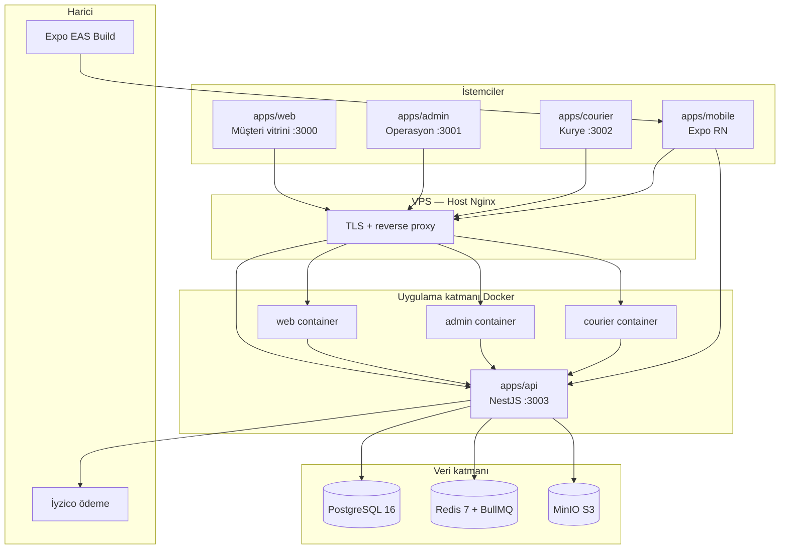
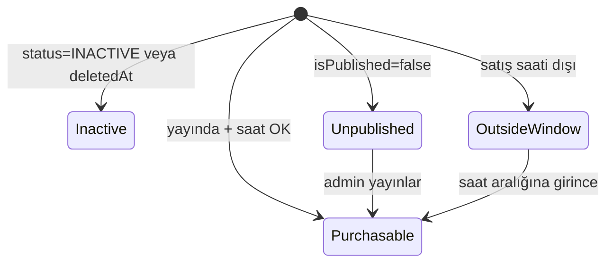
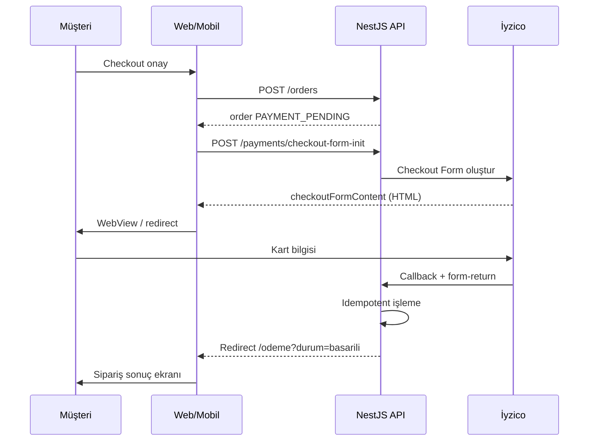

# Pastane Platform — Teknik ve Program Özellikleri Dokümantasyonu

| Alan | Değer |
|------|--------|
| **Proje adı** | Pastane Platform (Pasta-Hane) |
| **Tür** | Tek kiracılı pastane / fırın e-ticaret ve operasyon platformu |
| **Depo** | Monorepo (`pnpm` + Turborepo) |
| **Son güncelleme** | Mayıs 2026 |
| **Hedef kitle** | Geliştiriciler, DevOps, ürün/operasyon ekipleri |

Bu belge, projeye yeni katılan bir geliştiricinin mimariyi, iş kurallarını, teknik yığını, geliştirme ortamını ve dağıtım süreçlerini tek kaynaktan öğrenmesi için hazırlanmıştır. Resmi faz planı [`development-phases.md`](./development-phases.md); agent onboarding için [`AI_HANDOFF_CONTEXT.md`](./AI_HANDOFF_CONTEXT.md) referans alınır.

---

## İçindekiler

1. [Yönetici özeti](#1-yönetici-özeti)
2. [İş kapsamı ve kullanıcı rolleri](#2-iş-kapsamı-ve-kullanıcı-rolleri)
3. [Mimari genel bakış](#3-mimari-genel-bakış)
4. [Monorepo yapısı](#4-monorepo-yapısı)
5. [Teknoloji yığını](#5-teknoloji-yığını)
6. [Uygulamalar (apps)](#6-uygulamalar-apps)
7. [Paylaşılan paketler (packages)](#7-paylaşılan-paketler-packages)
8. [Backend API (NestJS)](#8-backend-api-nestjs)
9. [Veritabanı ve Prisma modeli](#9-veritabanı-ve-prisma-modeli)
10. [Kimlik doğrulama ve yetkilendirme](#10-kimlik-doğrulama-ve-yetkilendirme)
11. [İş alanları ve iş kuralları](#11-iş-alanları-ve-iş-kuralları)
12. [Ödeme akışı (İyzico)](#12-ödeme-akışı-iyzico)
13. [Frontend uygulamaları](#13-frontend-uygulamaları)
14. [Mobil uygulama (Expo)](#14-mobil-uygulama-expo)
15. [Harici entegrasyonlar](#15-harici-entegrasyonlar)
16. [Geliştirme ortamı kurulumu](#16-geliştirme-ortamı-kurulumu)
17. [Komut referansı](#17-komut-referansı)
18. [Docker ortamları](#18-docker-ortamları)
19. [Production ve VPS dağıtımı](#19-production-ve-vps-dağıtımı)
20. [Mobil dağıtım (EAS / Play Store)](#20-mobil-dağıtım-eas--play-store)
21. [Test, kalite ve CI](#21-test-kalite-ve-ci)
22. [Kod standartları ve kurallar](#22-kod-standartları-ve-kurallar)
23. [Faz planı ve mevcut durum](#23-faz-planı-ve-mevcut-durum)
24. [Ortam değişkenleri](#24-ortam-değişkenleri)
25. [Dokümantasyon indeksi](#25-dokümantasyon-indeksi)
26. [Yeni geliştirici onboarding kontrol listesi](#26-yeni-geliştirici-onboarding-kontrol-listesi)
27. [Sözlük](#27-sözlük)

---

## 1. Yönetici özeti

Pastane Platform, **tek bir pastane işletmesi** için uçtan uca dijital altyapı sağlar:

- Müşteri vitrini (web + mobil)
- Admin operasyon paneli
- Kurye teslimat paneli
- Ortak NestJS backend API
- PostgreSQL, Redis, MinIO, Docker tabanlı altyapı

**SaaS / çok kiracılı (multi-tenant) değildir.** Kiracı soyutlamaları eklenmemelidir.

**Temel prensipler:**

- İş kuralları **backend’de** uygulanır; fiyat, stok görünürlüğü, sipariş durumu ve sadakat hesapları sunucu tarafında doğrulanır.
- Tüm istemciler **aynı REST API**’yi (`/api/v1`) kullanır.
- Web/admin/kurye oturumları **httpOnly cookie + BFF** modeliyle yönetilir; access token tarayıcı JS’ine sızmaz.
- Mobil prod ortamı **build zamanında gömülen** `EXPO_PUBLIC_*` URL’leridir; VPS Docker yığınına deploy edilmez.

---

## 2. İş kapsamı ve kullanıcı rolleri

### 2.1 İş alanları

| Alan | Açıklama |
|------|----------|
| **Katalog** | Kategoriler, ürünler, alerjenler, görseller, seçenek grupları, satış birimleri (adet, gr, kg) |
| **Vitrin içeriği** | Ana sayfa banner’ları (görsel/video, zamanlama) |
| **Sepet ve checkout** | Sunucu taraflı fiyatlandırma, adres/mağaza seçimi |
| **Sipariş yaşam döngüsü** | Durum makinesi, kurye atama, iptal |
| **Ödeme** | İyzico Checkout Form, callback güvenliği, zaman aşımı |
| **Teslimat** | Kurye pickup/deliver/fail akışları |
| **Sadakat** | Puan, QR kod, hareket geçmişi |
| **Yorumlar** | Teslim sonrası müşteri yorumu, admin moderasyonu |
| **Bildirimler** | In-app liste; push/SMS/e-posta altyapısı hazır, prod provider’lar placeholder |
| **Kampanyalar** | Backend + admin UI (sınırlı kapsam) |
| **Raporlar** | Dashboard, satış, ürün özeti |
| **Denetim** | Audit log |

### 2.2 Kullanıcı rolleri (`RoleType`)

| Rol | Arayüz | Amaç |
|-----|--------|------|
| `ADMIN` | Admin | Tam sistem yönetimi |
| `ORDER_OPERATOR` | Admin | Sipariş operasyonu, kurye atama, banner |
| `PRODUCT_MANAGER` | Admin | Katalog, medya, birimler, banner |
| `COURIER` | Courier | Atanan teslimatları yürütme |
| `CUSTOMER` | Web / Mobil | Alışveriş, sipariş, sadakat |

Rol–izin eşlemesi seed dosyasında tanımlıdır: [`packages/database/prisma/seed.ts`](../packages/database/prisma/seed.ts).

---

## 3. Mimari genel bakış



**İstek akışı (web/admin/kurye):**

1. Tarayıcı → Next.js BFF route (`app/api/*`)
2. BFF → NestJS API (sunucu tarafı, cookie/session)
3. API → Prisma / Redis / MinIO / kuyruk

**Mobil:** Doğrudan `EXPO_PUBLIC_API_URL` üzerinden API; native fetch (CORS geçerli değil).

---

## 4. Monorepo yapısı

```
Pastane/
├── apps/
│   ├── api/          # NestJS backend
│   ├── web/          # Müşteri Next.js
│   ├── admin/        # Admin Next.js
│   ├── courier/      # Kurye Next.js
│   └── mobile/       # Expo + React Native
├── packages/
│   ├── database/     # Prisma schema, migrations, seed
│   ├── tr-api-errors/# Türkçe hata mesajları (web/admin/courier)
│   ├── types/        # Paylaşılan API tipleri
│   ├── constants/    # Sabitler
│   ├── ui/           # Paylaşılan UI (iskelet)
│   └── config/       # Paylaşılan config (iskelet)
├── docker/           # docker-compose.dev.yml, docker-compose.prod.yml, Dockerfile.*
├── deploy/           # Host Nginx config
├── docs/             # Teknik dokümantasyon
├── scripts/          # Deploy, VPS push, yardımcı scriptler
├── .cursor/rules/    # AI agent ve kod kuralları
├── package.json      # Kök workspace scriptleri
├── pnpm-workspace.yaml
└── turbo.json
```

**Paket yöneticisi:** pnpm 10.x  
**Monorepo orchestrator:** Turborepo 2.x  
**Node sürümü:** 22 LTS (`engines`: `>=22 <23`)

---

## 5. Teknoloji yığını

| Katman | Teknoloji | Sürüm / not |
|--------|-----------|-------------|
| Runtime | Node.js | 22 LTS |
| Dil | TypeScript | Strict mode |
| Backend framework | NestJS | 11 |
| ORM | Prisma | PostgreSQL provider |
| Veritabanı | PostgreSQL | 16 |
| Cache / kuyruk | Redis + BullMQ | 7 |
| Nesne depolama | MinIO | S3 uyumlu |
| Web framework | Next.js | 15 App Router |
| UI | React | 19 |
| Styling | Tailwind CSS | web/admin/courier |
| Form/validasyon | react-hook-form + zod | Tüm yüzeyler |
| Mobil | React Native + Expo | SDK 56, Expo Router |
| Ödeme | İyzico | Checkout Form API |
| Container | Docker Compose | dev + prod |
| CI/CD | GitHub Actions | main → VPS SSH deploy |

---

## 6. Uygulamalar (apps)

### 6.1 `apps/api` — Backend API

| Özellik | Değer |
|---------|--------|
| Paket adı | `@pastane/api` |
| Port | 3003 |
| Global prefix | `/api/v1` |
| Sağlık | `GET /health` (prefix dışı) |
| Swagger | `/api/docs` (`SWAGGER_ENABLED=true`) |

**Modüller (31):** auth, users, roles, permissions, categories, products, product-units, allergens, media, banners, stores, delivery-zones, cart, orders, payments, couriers, deliveries, addresses, reviews, loyalty, notifications, campaigns, settings, reports, audit, otp, jobs, health, prisma.

**Global guard sırası:** RateLimit → JWT → Roles → Permissions.

### 6.2 `apps/web` — Müşteri vitrini

| Özellik | Değer |
|---------|--------|
| Port | 3000 |
| Router | Next.js App Router |
| Dil | Türkçe URL’ler |

**Ana rotalar:**

| Rota | Açıklama |
|------|----------|
| `/` | Ana sayfa, banner, vitrin |
| `/shop`, `/kategori/[slug]` | Katalog |
| `/urun/[slug]` | Ürün detayı, seçenekler, yorumlar |
| `/sepet` | Sepet |
| `/odeme` | Checkout + İyzico dönüş |
| `/giris`, `/kayit` | Auth |
| `/adresler` | Adres CRUD |
| `/hesabim` | Profil özeti |
| `/siparisler`, `/siparisler/[id]` | Sipariş geçmişi ve takip |

### 6.3 `apps/admin` — Operasyon paneli

| Özellik | Değer |
|---------|--------|
| Port | 3001 |
| Erişim | ADMIN, ORDER_OPERATOR, PRODUCT_MANAGER |

**Modüller:** dashboard, products, categories, allergens, product-units, banners, campaigns, loyalty, stores, delivery-zones, orders, courier-assignment, couriers, reviews, reports, users, roles, permissions, settings, notifications, audit.

### 6.4 `apps/courier` — Kurye paneli

| Özellik | Değer |
|---------|--------|
| Port | 3002 |
| Erişim | COURIER rolü zorunlu |

**Akışlar:** atanan teslimat listesi → detay → pickup → deliver / fail (sebep zorunlu). Polling ~15 sn.

### 6.5 `apps/mobile` — Müşteri mobil uygulaması

| Özellik | Değer |
|---------|--------|
| Framework | Expo SDK 56, Expo Router |
| Android paket | `cloud.azem.pastahane` |
| Prod API | `https://api.azem.cloud` (build-time env) |

Detay: [Mobil uygulama bölümü](#14-mobil-uygulama-expo).

---

## 7. Paylaşılan paketler (packages)

| Paket | Amaç |
|-------|------|
| `@pastane/database` | Prisma schema ([`schema.prisma`](../packages/database/schema.prisma)), migrations, seed |
| `@pastane/tr-api-errors` | API `errorCode` → Türkçe mesaj (web/admin/courier audience) |
| `@pastane/types` | `ApiSuccessResponse`, `ApiErrorResponse` |
| `@pastane/constants` | Proje sabitleri |
| `@pastane/ui` | Gelecekte paylaşılan UI bileşenleri |
| `@pastane/config` | Gelecekte paylaşılan config |

**Prisma komutları** (`packages/database`):

```bash
pnpm prisma:generate          # Client üret
pnpm --filter @pastane/database prisma:migrate:dev
pnpm --filter @pastane/database prisma:migrate:deploy
pnpm --filter @pastane/database prisma:seed
```

Host’tan migrate/seed: kök `.env` yüklenir; Docker hostname `postgres` → `127.0.0.1` rewrite (bkz. [`development-workflow.md`](./development-workflow.md)).

---

## 8. Backend API (NestJS)

### 8.1 API sözleşmesi

**Başarılı yanıt:**

```json
{
  "success": true,
  "data": { },
  "meta": { "page": 1, "limit": 20, "total": 100, "totalPages": 5 }
}
```

**Hata yanıtı:**

```json
{
  "success": false,
  "statusCode": 400,
  "message": "Human readable message",
  "errorCode": "VALIDATION_FAILED",
  "errors": [{ "field": "email", "message": "..." }]
}
```

Kurallar: [`.cursor/rules/api-response-rules.mdc`](../.cursor/rules/api-response-rules.mdc)

### 8.2 Endpoint özeti

| Modül | Temel endpoint’ler | Auth |
|-------|-------------------|------|
| **auth** | `POST /auth/register`, `/login`, `/refresh`, `/logout` | Public (login/register) |
| **users** | `GET/PATCH /users/me`, admin CRUD | JWT |
| **categories** | Public tree/slug; admin CRUD | Karışık |
| **products** | Public list/slug/:slug/:id; admin list/CRUD | Karışık |
| **product-units** | Public list; admin CRUD | Karışık |
| **allergens** | Public list; admin CRUD | Karışık |
| **media** | Upload, get, delete | İzin gerekli |
| **banners** | `GET /banners/home`; admin CRUD, reorder, upload | Karışık |
| **stores** | Public list; admin CRUD | Karışık |
| **delivery-zones** | Public list; admin CRUD | Karışık |
| **cart** | `GET`, items CRUD, `POST validate-checkout` | CUSTOMER |
| **orders** | `POST` create; `GET my`, `GET :id`; admin list/status/assign/cancel | Rol bazlı |
| **payments** | `POST initiate`, `checkout-form-init`; İyzico callback | Karışık |
| **couriers** | Admin CRUD, deactivate | Admin |
| **deliveries** | `GET my`, pickup/deliver/fail | COURIER |
| **addresses** | CRUD + default | CUSTOMER |
| **reviews** | Create; public product reviews; moderation | Karışık |
| **loyalty** | me, movements, scan, redeem, settings | Rol bazlı |
| **notifications** | `GET me`; admin send | JWT |
| **campaigns** | Public active; admin CRUD | Karışık |
| **settings** | System flags, key upsert | Admin |
| **reports** | dashboard, sales, products | İzin gerekli |
| **audit** | List | Admin |
| **files** | `GET /files/:bucket/:encodedKey` | Public (proxy) |

Tam liste: [`apps/api/src/app.module.ts`](../apps/api/src/app.module.ts) import’ları ve ilgili `*.controller.ts` dosyaları.

### 8.3 Arka plan işleri (BullMQ)

| İş | Amaç |
|----|------|
| Payment timeout | `PAYMENT_PENDING` siparişleri süre dolunca iptal |
| Notification processing | Bildirim kuyruğu (FCM placeholder) |

---

## 9. Veritabanı ve Prisma modeli

**Schema:** [`packages/database/schema.prisma`](../packages/database/schema.prisma)

### 9.1 Enum’lar

`UserStatus`, `RoleType`, `ProductStatus`, `ProductUnitKind`, `DeliveryType`, `OrderStatus`, `PaymentStatus`, `CourierStatus`, `DeliveryStatus`, `ReviewStatus`, `LoyaltyMovementType`, `NotificationType`, `CampaignStatus`, `BannerMediaType`

### 9.2 Modeller (35)

| Grup | Modeller |
|------|----------|
| **Kimlik** | User, Role, Permission, RolePermission, RefreshToken, OtpCode |
| **Katalog** | Category, ProductUnit, Product, ProductImage, Allergen, ProductAllergen, ProductOptionGroup, ProductOption |
| **Operasyon** | Store, DeliveryZone |
| **Sepet** | Cart, CartItem, CartItemOption |
| **Sipariş** | Order, OrderItem, OrderItemOption, OrderStatusHistory, Payment |
| **Teslimat** | Courier, Delivery |
| **Sadakat** | LoyaltyAccount, LoyaltyMovement, LoyaltySetting |
| **İçerik** | Banner, Campaign |
| **Diğer** | Address, Review, Notification, Setting, AuditLog |

### 9.3 Önemli iş kuralları (veri modeli)

- **Soft delete:** Çoğu entity’de `deletedAt`.
- **Ürün görünürlüğü:** `isPublished`, `saleWindowStart` / `saleWindowEnd` (Europe/Istanbul). Eski stok rezervasyon tabloları kaldırıldı (2026-05 migration).
- **Ürün birimleri:** `ProductUnit` (adet, gr, kg, …) + `Product.unitQuantity` → API `displayName` (ör. `500 gr Sütlaç`).
- **Sipariş satırları:** `productNameSnapshot`, `unitPriceSnapshot` — fiyat/ad değişse bile geçmiş korunur.
- **Ödeme:** `Payment` kaydı, idempotency, callback sonucu.

### 9.4 Migration’lar

| Migration | Konu |
|-----------|------|
| `20260517182508_phase1_backend_core` | Temel şema |
| `20260517184123_phase2_catalog_stock` | Katalog (eski stok) |
| `20260517221500_phase3_order_payment_flow` | Sipariş/ödeme |
| `20260519143000_banners` | Banner CMS |
| `20260520120000_address_map_coordinates` | Adres koordinatları |
| `20260520140000_order_delivery_failed` | Teslimat başarısız durumu |
| `20260520180000_remove_stock_add_product_publication` | Stok tabloları kaldırıldı; yayın penceresi |
| `20260523120000_product_units` | Satış birimleri |

### 9.5 Seed verisi

Demo kullanıcılar (telefon / e-posta — [`seed.ts`](../packages/database/prisma/seed.ts)):

| Rol | Örnek |
|-----|--------|
| Admin | `admin@pastane.com` |
| Operatör | `operator@pastane.com` |
| Ürün yöneticisi | `product@pastane.com` |
| Kurye | `kurye1@pastane.com`, `kurye2@pastane.com` |
| Müşteri | `musteri@pastane.com` |

Şifreler seed dosyasında (`Admin123!`, vb.) — **yalnızca geliştirme ortamı**.

---

## 10. Kimlik doğrulama ve yetkilendirme

### 10.1 JWT modeli

| Token | Süre | Saklama |
|-------|------|---------|
| Access | ~15 dk (`JWT_ACCESS_EXPIRES_IN`) | Web: httpOnly cookie (BFF); Mobil: AsyncStorage |
| Refresh | ~30 gün | Hash’lenmiş DB (`RefreshToken`) |

Access payload: `sub`, `phone`, `role`, `permissions[]`.

### 10.2 Guard’lar

1. `@Public()` — JWT atlanır
2. `@Roles(...)` — Rol kontrolü
3. `@Permissions('code')` — İzin kodu kontrolü (authoritative)

Frontend sidebar/menü izinleri yalnızca UX; **backend karar vericidir**.

### 10.3 İzin kodları (örnekler)

Format: `module.action`

```
products.view, products.create, products.update, products.delete
productUnits.view, productUnits.manage
orders.viewAll, orders.assignCourier, orders.cancel
deliveries.viewOwn, deliveries.updateOwn
banners.view, banners.reorder
loyalty.scan, loyalty.redeem
...
```

Tam liste: [`packages/database/prisma/seed.ts`](../packages/database/prisma/seed.ts) → `permissions` dizisi.

---

## 11. İş alanları ve iş kuralları

### 11.1 Ürün satışa açıklığı



Mantık: [`apps/api/src/products/product-availability.util.ts`](../apps/api/src/products/product-availability.util.ts)

### 11.2 Sipariş durum makinesi

`NEW` → `PAYMENT_PENDING` → `CONFIRMED` → `PREPARING` → `READY` → `ASSIGNED_TO_COURIER` → `OUT_FOR_DELIVERY` → `DELIVERED`

Alternatif: `DELIVERY_FAILED`, `CANCELLED`

### 11.3 Teslimat tipleri

| Tip | Gereksinim |
|-----|------------|
| `HOME_DELIVERY` | Kayıtlı adres + teslimat bölgesi |
| `PICKUP` | Aktif mağaza seçimi |

### 11.4 Sepet

- Kullanıcı başına tek sepet.
- Satır sırası: `createdAt ASC`, `id ASC`.
- Fiyat: indirimli fiyat + seçenek farkları; sunucu hesaplar.
- Checkout öncesi `validate-checkout`.

### 11.5 Sadakat

- QR kod ile müşteri tanıma (admin/kasa).
- Puan kazanma / harcama / manuel düzeltme.
- Checkout’ta puan kullanımı (ayarlar aktifse).

### 11.6 Yorumlar

- Teslim edilmiş sipariş kalemi için müşteri yorumu.
- Admin: onay / red (sebep zorunlu) / sil.

---

## 12. Ödeme akışı (İyzico)



**Geliştirme:** `PAYMENT_DEV_AUTO_SUCCESS=true` (yalnızca `NODE_ENV !== production`).

**Zaman aşımı:** `PAYMENT_TIMEOUT_MS` (varsayılan 600000 ms) — BullMQ worker.

Detay: [`docs/iyzico_sandbox_entegrasyon_v3_web.md`](./iyzico_sandbox_entegrasyon_v3_web.md)

---

## 13. Frontend uygulamaları

### 13.1 Ortak desenler

| Desen | Açıklama |
|-------|----------|
| **BFF proxy** | `app/api/catalog/*`, `app/api/auth/*` — cookie session |
| **Hata eşleme** | `@pastane/tr-api-errors` → Türkçe kullanıcı mesajı |
| **Form validasyon** | zod şemaları (`lib/*/schemas.ts`) |
| **Polling** | Admin siparişler, kurye teslimatlar, müşteri takip (WebSocket yok — [`adr-polling-strategy.md`](./adr-polling-strategy.md)) |

### 13.2 Web BFF ortam değişkenleri

| Değişken | Açıklama |
|----------|----------|
| `WEB_API_URL` | Docker içi API (`http://api:3003`) |
| `API_URL` | Host geliştirmede fallback |
| `RUNNING_IN_DOCKER=1` | Hostname çözümlemesi |

### 13.3 Admin / Courier

Aynı BFF modeli; `ADMIN_API_URL`, `COURIER_API_URL`.

---

## 14. Mobil uygulama (Expo)

### 14.1 Yapı

```
apps/mobile/
├── app/                    # Expo Router (file-based)
│   ├── (tabs)/             # home, products, cart, orders, account
│   ├── product/[slug].tsx
│   ├── checkout.tsx
│   ├── payment-result.tsx
│   ├── login.tsx, register.tsx
│   ├── addresses/*
│   └── orders/[id].tsx
├── src/
│   ├── api/                # API client + auth refresh
│   ├── context/            # Auth, Cart
│   ├── components/
│   └── utils/
├── app.config.ts
├── eas.json
└── assets/
```

### 14.2 Phase 7 özellikleri

| Özellik | Durum |
|---------|--------|
| Vitrin, kategoriler, ürün detayı | ✅ |
| Sepet (güncelle/sil) | ✅ |
| Giriş / kayıt, oturum yenileme | ✅ |
| Adres CRUD | ✅ |
| Sipariş + İyzico WebView | ✅ |
| Sipariş listesi, detay, iptal | ✅ |
| Ürün yorumları | ✅ |
| Sadakat QR + hareketler | ✅ |
| In-app bildirim listesi | ✅ |
| Push (FCM) | ⏳ Backend placeholder |

### 14.3 Ortam

| Ortam | API URL |
|-------|---------|
| Dev (Android emülatör) | `http://10.0.2.2:3003` |
| Prod (EAS build) | `https://api.azem.cloud` |

Detay: [`apps/mobile/README.md`](../apps/mobile/README.md), [`mobile-deploy-prep.md`](./mobile-deploy-prep.md)

---

## 15. Harici entegrasyonlar

| Servis | Durum | Not |
|--------|-------|-----|
| **İyzico** | Entegre | Sandbox/prod `IYZICO_*` env |
| **MinIO** | Entegre | Ürün görselleri, banner medya |
| **NetGSM** | Placeholder | `OTP_ACTIVE=false` varsayılan |
| **FCM** | Placeholder | Push bildirim altyapısı |
| **SMTP** | Placeholder | E-posta bildirimleri |

---

## 16. Geliştirme ortamı kurulumu

### 16.1 Ön koşullar

- Node.js 22
- pnpm 10
- Docker + Docker Compose (önerilir)
- Git

### 16.2 İlk kurulum

```bash
git clone <repo-url> Pastane && cd Pastane
cp .env.example .env          # Değerleri düzenleyin
pnpm install
pnpm prisma:generate
pnpm --filter @pastane/tr-api-errors build
pnpm docker:dev:up
pnpm --filter @pastane/database prisma:migrate:deploy
pnpm --filter @pastane/database prisma:seed   # isteğe bağlı demo veri
pnpm check                                    # lint + typecheck + test + build
```

### 16.3 Günlük geliştirme

```bash
pnpm docker:dev:up              # Altyapı + tüm servisler
pnpm dev                        # veya tek app: pnpm --filter @pastane/web dev
pnpm mobile:start               # Mobil (API ayaktayken)
```

Sorun giderme: [`local-development.md`](./local-development.md)

---

## 17. Komut referansı

### 17.1 Kök komutlar

| Komut | Açıklama |
|-------|----------|
| `pnpm dev` | Tüm app’ler paralel dev |
| `pnpm dev:web-apps` | web + admin + courier |
| `pnpm build` | prisma generate + turbo build |
| `pnpm build:ci` | CI build (`.next-ci`) |
| `pnpm lint` | ESLint (turbo) |
| `pnpm typecheck` | TypeScript (turbo) |
| `pnpm test` | Jest + Vitest |
| `pnpm check` | lint + typecheck + test + build:ci |
| `pnpm format` / `format:check` | Prettier |
| `pnpm prisma:generate` | Prisma client |
| `pnpm docker:dev:up/down/logs` | Yerel dev Compose |
| `pnpm docker:dev:up-exclusive` | Önce yerel prod konteynerlerini güvenli durdur → tam dev Compose |
| `pnpm push:vps` | typecheck → git push → VPS `./deploy.sh` |
| `pnpm push:vps:fast` | typecheck atlanır |
| `pnpm fix:next-perms` | Docker `.next` izin düzeltme |
| `pnpm fix:frontend-cache` | Bozuk Next cache temizliği |
| `pnpm mobile:start` | Expo dev server |
| `pnpm mobile:typecheck` | Mobil TS kontrol |
| `pnpm mobile:build:android` | EAS production AAB |
| `pnpm mobile:build:android:apk` | EAS preview APK |

### 17.2 App bazlı

| App | Dev | Test |
|-----|-----|------|
| api | `pnpm --filter @pastane/api dev` | Jest |
| web/admin/courier | `pnpm --filter @pastane/web dev` | Vitest |
| mobile | `pnpm --filter @pastane/mobile start` | — |

---

## 18. Docker ortamları

### 18.1 Development (`docker/docker-compose.dev.yml`)

| Servis | Port | Not |
|--------|------|-----|
| postgres | 5432 | PG 16 |
| redis | 6379 | Şifreli |
| minio | 9000/9001 | S3 API + console |
| api | 3003 | Hot reload, schema mount |
| web | 3000 | `WEB_API_URL=http://api:3003` |
| admin | 3001 | |
| courier | 3002 | |

**Önemli:** Kök `node_modules` container’a mount edilir (pnpm symlink uyumu). Next cache: `apps/*/.next-docker`.

### 18.2 Production (`docker/docker-compose.prod.yml`)

- **Yalnızca VPS** üzerinde `deploy.sh` ile kullanılır; geliştiricide yerel compose ile çalıştırılmaz.
- PostgreSQL ve Redis **WAN’a açılmaz**.
- Uygulamalar loopback portlarında dinler; **Host Nginx** TLS sonlandırır.
- Compose içinde nginx servisi **yok** — config: [`deploy/nginx/pastane-app`](../deploy/nginx/pastane-app).

---

## 19. Production ve VPS dağıtımı

### 19.1 Ortamlar

| Ortam | Domain (örnek) | Deploy yöntemi |
|-------|----------------|----------------|
| Production | `azem.cloud`, `api.azem.cloud`, … | VPS Docker + Host Nginx |
| Mobil prod | Play Store AAB | Expo EAS (ayrı pipeline) |

### 19.2 VPS deploy akışı

```bash
# scripts/deploy-vps.env.local → VPS_HOST=...
pnpm push:vps
```

Adımlar ([`scripts/push-vps.sh`](../scripts/push-vps.sh)):

1. `pnpm typecheck`
2. `git push origin main`
3. SSH → VPS `./deploy.sh` (git pull, compose build/up, `prisma migrate deploy`, health check)

**GitHub Actions:** `.github/workflows/deploy.yml` — `main` push → aynı SSH deploy.

**Not:** Geliştiricide üretim `docker-compose` tetiklenmez; eski **`pastane_*_prod`** kalıntısı için **`bash scripts/docker-stop-local-prod.sh`** kullanılır.

### 19.3 Operasyon

| Konu | Doküman |
|------|---------|
| Genel ops | [`OPERATIONS.md`](./OPERATIONS.md) |
| azem.cloud runbook | [`azem-cloud-vps-deployment.md`](./azem-cloud-vps-deployment.md) |
| CI SSH | [`GITHUB_CI_SSH.md`](./GITHUB_CI_SSH.md) |
| Yedekleme | [`backup-and-restore.md`](./backup-and-restore.md) |
| Rollback | `scripts/rollback-prod.sh` |

---

## 20. Mobil dağıtım (EAS / Play Store)

Mobil uygulama **VPS Docker’a deploy edilmez**.

| Profil | Çıktı | Kullanım |
|--------|-------|----------|
| `development` | Dev client | Geliştirme |
| `preview` | APK | Internal test |
| `production` | AAB | Play Store |

```bash
cd apps/mobile
npx eas-cli login
npx eas init
pnpm mobile:build:android        # AAB
pnpm mobile:build:android:apk    # APK
```

Prod URL’ler `eas.json` içinde: `EXPO_PUBLIC_API_URL=https://api.azem.cloud`

---

## 21. Test, kalite ve CI

### 21.1 Test türleri

| Tür | Konum | Araç |
|-----|-------|------|
| API unit/integration | `apps/api/src/**/*.spec.ts` | Jest |
| Web/admin/courier | `**/*.spec.ts`, `**/*.test.ts` | Vitest |
| tr-api-errors | `packages/tr-api-errors` | Vitest |
| E2E | Planlanmış / manuel QA | [`qa-test-scenarios.md`](./qa-test-scenarios.md) |

### 21.2 Kalite kapısı

Faz tamamlanmadan önce:

```bash
pnpm lint && pnpm typecheck && pnpm test && pnpm build:ci
```

Kritik akışlar için E2E önceliği: auth, ödeme callback, sepet, sipariş yaşam döngüsü, yetkilendirme ([`testing-quality-rules.mdc`](../.cursor/rules/testing-quality-rules.mdc)).

### 21.3 Regresyon

[`regression-checklist.md`](./regression-checklist.md), [`final-pre-vps-checklist.md`](./final-pre-vps-checklist.md)

---

## 22. Kod standartları ve kurallar

### 22.1 Adlandırma

| Öğe | Konvansiyon |
|-----|-------------|
| Klasör/dosya | `kebab-case` |
| Sınıf/bileşen | `PascalCase` |
| Değişken/fonksiyon | `camelCase` |
| Sabitler | `SCREAMING_SNAKE_CASE` |

### 22.2 Mimari kurallar

- Controller ince; iş mantığı service’te.
- DTO + class-validator ile giriş doğrulama.
- İş kuralları backend’de; istemciler arası tekrar yok.
- Faz erken implementasyonu **yasak** ([`phase-development-rules.mdc`](../.cursor/rules/phase-development-rules.mdc)).

### 22.3 Git workflow

- Kısa ömürlü branch: `feat/...`, `fix/...`, `codex/phase-XX-...`
- Conventional Commits: `feat:`, `fix:`, `chore:`, `docs:`, `test:`
- Detay: [`git-workflow-rules.mdc`](../.cursor/rules/git-workflow-rules.mdc), [`COMMIT_CONVENTIONS.md`](../COMMIT_CONVENTIONS.md)

### 22.4 Cursor agent kuralları

[`.cursor/rules/`](../.cursor/rules/) — backend, frontend, prisma, docker, security, testing, vb.

---

## 23. Faz planı ve mevcut durum

Resmi sıra: [`development-phases.md`](./development-phases.md)

| Faz | Konu | Durum |
|-----|------|--------|
| **0** | Monorepo, Docker, iskelet | ✅ Tamamlandı |
| **1** | Backend core, auth, RBAC | ✅ Tamamlandı |
| **2** | Katalog, medya, mağaza, bölgeler | ✅ Tamamlandı (stok → yayın penceresi) |
| **3** | Sepet, sipariş, ödeme | ✅ Tamamlandı |
| **4** | Admin panel | ✅ Tamamlandı |
| **5** | Kurye paneli | ✅ Tamamlandı |
| **6** | Müşteri web | ✅ Tamamlandı |
| **7** | Mobil uygulama | 🟡 Expo iskeleti + Phase 7 akışları; EAS/Play Store hazırlığı devam |
| **8** | Loyalty/bildirim/kampanya/rapor | 🟡 Backend + kısmi UI; canlı FCM/SMS bekliyor |

**Önerilen sıradaki iş:** Production sertleştirme, E2E, canlı bildirim provider’ları.

Eski durum raporu [`proje-durum-raporu.md`](./proje-durum-raporu.md) (2026-05-18) — faz durumu için **güncel değil**; [`AI_HANDOFF_CONTEXT.md`](./AI_HANDOFF_CONTEXT.md) kullanın.

---

## 24. Ortam değişkenleri

### 24.1 Şablon dosyalar

| Dosya | Kullanım |
|-------|----------|
| [`.env.example`](../.env.example) | Yerel geliştirme |
| [`.env.production.example`](../.env.production.example) | Production (VPS) |

### 24.2 Kategoriler

| Kategori | Örnek değişkenler |
|----------|-------------------|
| Uygulama | `NODE_ENV`, `API_PORT`, `API_URL`, `PUBLIC_API_URL` |
| Veritabanı | `DATABASE_URL`, `POSTGRES_*` |
| Redis | `REDIS_HOST`, `REDIS_PASSWORD` |
| JWT | `JWT_SECRET`, `JWT_REFRESH_SECRET`, `JWT_*_EXPIRES_IN` |
| MinIO | `MINIO_*`, `MINIO_BUCKET_*`, `MINIO_PUBLIC_DOMAIN` |
| Ödeme | `IYZICO_*`, `PAYMENT_DEV_AUTO_SUCCESS`, `PAYMENT_TIMEOUT_MS` |
| İletişim | `OTP_ACTIVE`, `SMS_PROVIDER`, `FCM_*`, `SMTP_*` |
| Frontend | `WEB_URL`, `ADMIN_URL`, `NEXT_PUBLIC_*`, `WEB_API_URL` |
| Mobil | `EXPO_PUBLIC_API_URL`, `EXPO_PUBLIC_WEB_URL` |
| Deploy | `VPS_HOST` (`scripts/deploy-vps.env.local`) |

**Güvenlik:** Secret’lar repoya commit edilmez. Production’da `PAYMENT_DEV_AUTO_SUCCESS` **asla** true olmamalı.

---

## 25. Dokümantasyon indeksi

| Belge | Konu |
|-------|------|
| [`README.md`](../README.md) | Hızlı başlangıç |
| **Bu belge** | Kapsamlı teknik referans |
| [`AI_HANDOFF_CONTEXT.md`](./AI_HANDOFF_CONTEXT.md) | Agent onboarding, güncel durum |
| [`local-development.md`](./local-development.md) | Kurulum, Docker, sorun giderme |
| [`development-workflow.md`](./development-workflow.md) | Geliştirme akışı |
| [`development-phases.md`](./development-phases.md) | Resmi faz planı |
| [`project-standards.md`](./project-standards.md) | Teknoloji standartları |
| [`OPERATIONS.md`](./OPERATIONS.md) | VPS operasyonları |
| [`azem-cloud-vps-deployment.md`](./azem-cloud-vps-deployment.md) | azem.cloud deploy |
| [`mobile-deploy-prep.md`](./mobile-deploy-prep.md) | Mobil/EAS |
| [`apps/mobile/README.md`](../apps/mobile/README.md) | Mobil geliştirme |
| [`adr-polling-strategy.md`](./adr-polling-strategy.md) | Polling kararı |
| [`iyzico_sandbox_entegrasyon_v3_web.md`](./iyzico_sandbox_entegrasyon_v3_web.md) | İyzico |
| [`qa-test-scenarios.md`](./qa-test-scenarios.md) | QA senaryoları |
| [`final-system-acceptance-report.md`](./final-system-acceptance-report.md) | Sistem kabul raporu |

---

## 26. Yeni geliştirici onboarding kontrol listesi

- [ ] Node 22 + pnpm kurulu
- [ ] Repoyu klonla, `.env` oluştur
- [ ] `pnpm install && pnpm prisma:generate`
- [ ] `pnpm docker:dev:up` — tüm servisler ayakta
- [ ] Migration + seed çalıştır
- [ ] `pnpm check` yeşil
- [ ] Tarayıcıda: web `:3000`, admin `:3001`, courier `:3002`, API health `:3003/health`
- [ ] Seed admin ile admin paneline giriş
- [ ] Seed müşteri ile web’de sepet → checkout (dev auto payment veya sandbox)
- [ ] Seed kurye ile courier panelinde teslimat akışı
- [ ] Bu belge + `AI_HANDOFF_CONTEXT.md` + aktif faz dokümanını oku
- [ ] `.cursor/rules/` kurallarını gözden geçir
- [ ] Mobil geliştireceksen: `apps/mobile/README.md` + Expo hesabı

---

## 27. Sözlük

| Terim | Açıklama |
|-------|----------|
| **BFF** | Backend-for-Frontend; Next.js API route’ları cookie session yönetir |
| **EAS** | Expo Application Services; bulut build (AAB/APK) |
| **displayName** | Birim + miktar + ürün adı (ör. `500 gr Sütlaç`) |
| **Idempotency** | Aynı ödeme isteğinin tekrarında çift işlem engeli |
| **Soft delete** | `deletedAt` ile mantıksal silme |
| **Sale window** | Günlük satış saati aralığı (Europe/Istanbul) |
| **Snapshot** | Sipariş anındaki fiyat/ad kopyası (değişime karşı) |

---

*Bu doküman canlı bir referanstır. Mimari veya faz değişikliklerinde güncellenmelidir. Sorular için önce [`AI_HANDOFF_CONTEXT.md`](./AI_HANDOFF_CONTEXT.md) ve ilgili faz kabul raporlarına bakın.*
