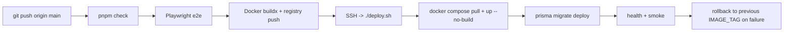

# GitHub Actions registry deploy

Bu akışta production image build işlemi **GitHub Actions** içinde yapılır, image'lar varsayılan olarak **GHCR (`ghcr.io`)** üzerine push edilir, VPS tarafı ise yalnızca doğru tag'i **pull + up + migrate + health/smoke** sırasıyla çalıştırır.

## Uçtan uca akış



Normal deploy:

1. Geliştirici `main` dalına push eder.
2. `.github/workflows/deploy.yml` aynı commit için `pnpm check` ve `e2e` çalıştırır.
3. `api`, `web`, `admin`, `courier` production image'ları registry'ye push edilir.
4. Workflow SSH ile VPS'e bağlanır ve `DEPLOY_GIT_REF`, `REGISTRY`, `REGISTRY_SERVER`, `IMAGE_TAG` değişkenleriyle `./deploy.sh` çağırır.
5. VPS script'i registry login yapar, image'ları pull eder, `up -d --no-build` ile ayağa kaldırır, migration çalıştırır ve health/smoke doğrular.

## Varsayılan tag stratejisi

- **Immutable deploy tag:** commit SHA (`github.sha`)
- **Moving alias:** `main` (yalnızca `push` ile `main` deploy'larında)
- VPS `.env.production` içinde `IMAGE_TAG=main` fallback olarak tutulabilir; workflow gerçek deploy sırasında SHA override eder.

## GitHub Actions gereksinimleri

### Secrets / Variables

Workflow önce `secrets.NAME`, sonra `vars.NAME` okur.

Zorunlu VPS erişimi:

- `VPS_HOST`
- `VPS_USER`
- `VPS_SSH_KEY`
- `VPS_PORT` (opsiyonel, varsayılan `22`)

Zorunlu build/deploy URL bilgileri:

- `NEXT_PUBLIC_API_URL` veya `DOMAIN_API`
- `WEB_URL` veya `DOMAIN_WEB`
- `ADMIN_URL` veya `DOMAIN_ADMIN`
- `COURIER_URL` veya `DOMAIN_COURIER`
- `API_HEALTH_URL` veya `DOMAIN_API`

Opsiyonel registry override:

- `REGISTRY` (varsayılan: `ghcr.io/<github-owner-lowercase>`)
- `REGISTRY_HOST` (varsayılan: `ghcr.io`)
- `REGISTRY_USERNAME`
- `REGISTRY_PASSWORD`

### GHCR varsayılanı

GHCR için ayrı Actions push secret'ı gerekmez:

- workflow `permissions.packages: write` kullanır
- login için varsayılan olarak `github.actor` + `GITHUB_TOKEN` kullanılır

Harici registry kullanacaksanız `REGISTRY_USERNAME` ve `REGISTRY_PASSWORD` ekleyin.

## VPS gereksinimleri

`/var/www/pastane-app/app/.env.production` içinde en az şu alanlar dolu olmalı:

```dotenv
REGISTRY=ghcr.io/your-github-owner
REGISTRY_SERVER=ghcr.io
REGISTRY_USERNAME=your-github-username
REGISTRY_PASSWORD=read-packages-token
IMAGE_TAG=main
```

Notlar:

- `REGISTRY_PASSWORD` için yalnızca **read:packages** yetkili bir token kullanın.
- `IMAGE_TAG=main` fallback amaçlıdır; gerçek deploy'larda workflow commit SHA gönderir.
- `deploy.sh` başarılı deploy sonrası `.pastane-deploy-current-tag`, deploy öncesinde ise `.pastane-deploy-previous-tag` yazar.

## workflow_dispatch

Workflow iki manuel input kabul eder:

- `git_ref`: branch, tag veya SHA
- `image_tag`: istenirse image tag override

Örnek kullanım:

- Belirli bir branch'i üretmek ve deploy etmek: `git_ref=main`
- Belirli bir commit'i deploy etmek: `git_ref=<commit-sha>`
- Elle tag adı vermek: `git_ref=<commit-sha>`, `image_tag=release-2026-05-25`

## Manuel fallback

Günlük akışta önerilen komut:

```bash
pnpm push:vps
```

Bu komut artık **yalnızca git push** yapar; deploy'un geri kalanını GitHub Actions üstlenir.

Acil durumda SSH ile doğrudan VPS deploy tetiklemek için:

```bash
DEPLOY_GIT_REF=<sha-or-branch> \
REGISTRY=ghcr.io/your-github-owner \
IMAGE_TAG=<tag> \
./scripts/deploy-vps.sh --remote-only
```

## Rollback

Otomatik rollback:

- GitHub runner dış health check'te başarısız olursa workflow VPS'te `.pastane-deploy-previous-tag` dosyasını okuyup `scripts/rollback-prod.sh` çağırır.

Manuel rollback:

- bkz. [`ROLLBACK_GUIDE.md`](./ROLLBACK_GUIDE.md)

## İlgili dosyalar

- [`.github/workflows/deploy.yml`](../.github/workflows/deploy.yml)
- [`deploy.sh`](../deploy.sh)
- [`scripts/deploy-vps.sh`](../scripts/deploy-vps.sh)
- [`scripts/push-vps.sh`](../scripts/push-vps.sh)
- [`scripts/rollback-prod.sh`](../scripts/rollback-prod.sh)
