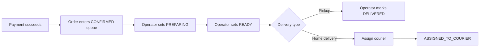
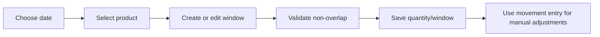
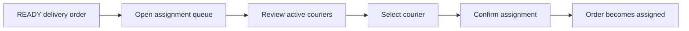
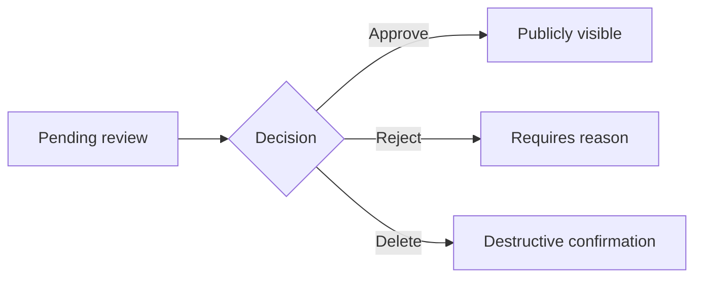

# Phase 4 Admin Panel Planning Document

## 1. Scope and planning principles

Phase 4 is limited to the operational admin surface in `apps/admin`.

Included in this phase:
- admin authentication shell
- dashboard
- product management
- category management
- stock management
- order management
- courier assignment workflow
- review moderation workflow
- basic reports
- role-aware navigation and action visibility

Explicitly excluded from this phase:
- courier panel UI
- customer-facing frontend
- loyalty UI
- campaigns UI
- notifications UI
- refunds UI
- full customer management UI unless later promoted into scope

The admin panel should optimize for:
1. speed of routine work,
2. low error rate on destructive actions,
3. dense but readable information,
4. permission-aware safety,
5. responsive operation on desktop first, tablet second, mobile fallback.

---

## 2. Role model for the admin panel

### 2.1 Roles that may enter the admin application

| Role | Admin panel access | Primary use |
|---|---:|---|
| ADMIN | Yes | Full control |
| ORDER_OPERATOR | Yes | Orders, courier assignment, limited dashboard/reports |
| PRODUCT_MANAGER | Yes | Products, categories, stock, limited reports |
| COURIER | No | Uses courier app in Phase 5 |
| CUSTOMER | No | Uses customer surfaces |

### 2.2 Role-to-section visibility

| Section | ADMIN | ORDER_OPERATOR | PRODUCT_MANAGER |
|---|---:|---:|---:|
| Dashboard | Yes | Yes | Yes |
| Orders | Yes | Yes | No |
| Products | Yes | No | Yes |
| Categories | Yes | No | Yes |
| Stock | Yes | Read only | Yes |
| Couriers | Yes | Assignment-only visibility | No |
| Reviews | Yes | View only if retained by permission policy | No |
| Reports | Yes | Sales only | Product reports only |
| Settings / stores / delivery zones | Yes | No | No |
| Users / roles / permissions | Yes | No | No |

### 2.3 Permission visibility rules

Navigation and actions must be permission-driven, not role-string-driven, wherever possible.

Examples:
- Show **Products** section if user has any of `products.view`, `products.create`, `products.update`.
- Show **Create product** only with `products.create`.
- Show **Delete product** only with `products.delete`.
- Show **Orders** section only with `orders.viewAll`.
- Show **Change order status** only with `orders.updateStatus`.
- Show **Assign courier** only with `orders.assignCourier`.
- Show **Stock adjustment** only with `stock.adjust`.
- Show **Review moderation actions** only with `reviews.moderate`.

UI hiding is only a convenience layer. Backend permission checks remain authoritative.

---

## 3. Information architecture

### 3.1 Recommended sidebar structure

```text
Dashboard

Operations
- Orders
- Courier Assignment
- Reviews

Catalog
- Products
- Categories
- Stock

Reports
- Sales Overview
- Product Performance

Administration
- Stores
- Delivery Zones
- Users
- Roles & Permissions
```

### 3.2 Sidebar visibility by permission

| Nav item | Required permission(s) |
|---|---|
| Dashboard | any admin-app permission |
| Orders | `orders.viewAll` |
| Courier Assignment | `orders.assignCourier` or `couriers.view` |
| Reviews | `reviews.view` or `reviews.moderate` |
| Products | `products.view` |
| Categories | `categories.view` |
| Stock | `stock.view` |
| Sales Overview | `reports.sales` |
| Product Performance | `reports.products` |
| Stores | `settings.update` or future `settings.view` |
| Delivery Zones | `settings.update` or future `settings.view` |
| Users | `users.view` |
| Roles & Permissions | `roles.view` or `permissions.view` |

### 3.3 Global header

- page title and breadcrumb
- date/time context where operationally useful
- environment badge in non-production
- current user menu
- quick search entry point, initially for orders/products if supported
- global refresh action on operational pages

---

## 4. Admin layout architecture

### 4.1 Layout zones

```text
AdminShell
├── Sidebar
├── Topbar
├── MainContent
│   ├── PageHeader
│   ├── FilterBar
│   ├── ContentRegion
│   └── ActionDrawer / DialogLayer
└── Toast / Confirm / GlobalError layer
```

### 4.2 Responsive behavior

| Breakpoint | Behavior |
|---|---|
| Desktop | Persistent sidebar, dense tables, split detail panes where useful |
| Tablet | Collapsible sidebar, table horizontal scroll, dialogs remain modal |
| Mobile fallback | Drawer sidebar, stacked filters, card/list fallback for critical workflows; no separate courier/mobile UX introduced |

### 4.3 Visual density

- Dashboard: medium density
- Orders / stock / products: high density tables with sticky headers where useful
- Mutating workflows: dialogs or side drawers with explicit confirmation
- Destructive actions: separated visually and require confirmation

---

## 5. Next.js 15 architecture strategy

### 5.1 Server vs client components

Use Server Components by default for:
- page shells
- initial data hydration
- permission-aware layout composition
- SEO-irrelevant but server-safe initial fetches

Use Client Components for:
- tables with sorting/filter interaction
- forms
- dialogs/drawers
- optimistic local edits where appropriate
- file upload interactions
- live operational refresh controls

### 5.2 Data fetching strategy

- Server-side page loaders fetch initial datasets and current-user permissions.
- Client-side revalidation handles filtering, mutation follow-up, and background refresh.
- Keep one shared admin API client abstraction rather than page-specific fetch wrappers.
- Prefer URL-driven filters so pages are shareable and restorable.
- Mutations should return typed results and invalidate only affected queries.

### 5.3 State management approach

| State type | Recommended handling |
|---|---|
| Server state | TanStack Query or equivalent query cache |
| URL state | search params for page, filters, sort |
| Form state | React Hook Form + schema validation |
| Auth/session state | server-derived session + minimal client context |
| Local UI state | component-local state or lightweight store only when cross-widget |

Avoid a global client store for server-derived business data.

---

## 6. Recommended component structure

```text
apps/admin/
├── app/
│   ├── (auth)/login/
│   └── (dashboard)/
│       ├── layout.tsx
│       ├── page.tsx
│       ├── orders/
│       ├── products/
│       ├── categories/
│       ├── stock/
│       ├── reviews/
│       ├── reports/
│       ├── stores/
│       └── delivery-zones/
├── components/
│   ├── layout/
│   ├── tables/
│   ├── filters/
│   ├── forms/
│   ├── feedback/
│   └── domain/
│       ├── orders/
│       ├── products/
│       ├── stock/
│       └── reviews/
├── lib/
│   ├── api/
│   ├── auth/
│   ├── permissions/
│   └── formatters/
└── hooks/
```

Shared reusable primitives:
- `DataTable`
- `PageHeader`
- `FilterBar`
- `StatusBadge`
- `PermissionGate`
- `ConfirmDialog`
- `EmptyState`
- `InlineError`
- `EntityDrawer`

---

## 7. API dependency map

### 7.1 Already available after Phase 3

| Domain | Existing dependencies |
|---|---|
| Products | `GET /products`, `POST /products`, `PATCH /products/:id`, `DELETE /products/:id`, option/allergen endpoints |
| Categories | category CRUD endpoints |
| Stock | stock list, by-product, create, update, movement endpoints |
| Media | upload/get/delete endpoints |
| Stores | list/create/update/delete endpoints |
| Delivery zones | list/create/update/delete endpoints |
| Auth/current user | login, users/me |

### 7.2 Required before or during Phase 4 implementation

| Workflow | Required backend surface |
|---|---|
| Admin order list | `GET /orders` with filters + pagination |
| Order detail for operators/admins | admin-authorized `GET /orders/:id` |
| Order status update | `PATCH /orders/:id/status` |
| Courier list | `GET /couriers` |
| Courier assignment | `POST /orders/:id/assign-courier` |
| Reviews queue | `GET /reviews/pending` |
| Review moderation | `PATCH /reviews/:id/approve`, `PATCH /reviews/:id/reject`, `DELETE /reviews/:id` |
| Sales dashboard/report widgets | report endpoints or dedicated dashboard summary endpoint |

Planning note: these are expected Phase 4 backend additions; the UI should not assume them already exist today.

---

## 8. Page specifications

## 8.1 Login page

| Field | Definition |
|---|---|
| Purpose | Authenticate staff users into the admin app |
| Visible roles | Public route, but only ADMIN / ORDER_OPERATOR / PRODUCT_MANAGER may proceed after login |
| API dependencies | `POST /auth/login`, current-user bootstrap via `/users/me` |
| Actions | Login, show invalid credential errors, redirect by default landing page |
| Filters | None |
| Status transitions | None |
| Validation constraints | Required identifier/phone and password; reject non-admin-surface roles after authentication |

## 8.2 Dashboard

| Field | Definition |
|---|---|
| Purpose | Give each staff role a fast operational overview |
| Visible roles | ADMIN, ORDER_OPERATOR, PRODUCT_MANAGER |
| API dependencies | Existing operational endpoints plus future report/dashboard summary endpoints |
| Actions | Navigate into filtered queues, refresh widgets |
| Filters | Date range, optional store if multi-store support later |
| Status transitions | None directly |
| Validation constraints | Widgets only appear when backing permission and data access exist |

Recommended widgets:
- `Orders awaiting action`
- `Orders in preparation`
- `Ready for courier assignment`
- `Low stock today`
- `Out-of-stock products`
- `Pending reviews`
- `Today sales` (ADMIN / ORDER_OPERATOR with `reports.sales`)
- `Top products` (ADMIN / PRODUCT_MANAGER with `reports.products`)

## 8.3 Orders list

| Field | Definition |
|---|---|
| Purpose | Central operations queue for incoming and active orders |
| Visible roles | ADMIN, ORDER_OPERATOR |
| API dependencies | Required Phase 4: `GET /orders` with pagination and filters |
| Actions | Open detail, update status when allowed, cancel when allowed, assign courier when eligible |
| Filters | order number, customer, delivery type, status, payment status, date range, scheduled date, courier assigned/unassigned |
| Status transitions | Show only valid next states from centralized transition rules |
| Validation constraints | No invalid transitions; cancelled/delivered orders are terminal; assignment only on eligible states |

Recommended columns:
- order number
- created time
- customer
- delivery type
- scheduled time
- order status
- payment status
- total
- assigned courier
- quick actions

## 8.4 Order detail

| Field | Definition |
|---|---|
| Purpose | Full operational view of one order without relying on mutable product data |
| Visible roles | ADMIN, ORDER_OPERATOR |
| API dependencies | Required Phase 4: admin-authorized `GET /orders/:id`, `PATCH /orders/:id/status`, `POST /orders/:id/assign-courier` |
| Actions | Change status, assign/reassign courier, cancel, inspect payment, inspect timeline |
| Filters | None on detail page |
| Status transitions | `PAYMENT_PENDING -> CONFIRMED/CANCELLED`; `CONFIRMED -> PREPARING/CANCELLED`; `PREPARING -> READY`; `READY -> ASSIGNED_TO_COURIER` for delivery or `DELIVERED` for pickup; later courier-driven states after Phase 5 |
| Validation constraints | Render snapshot item names/prices; never hydrate historical lines from current product data; require confirmation for cancel; block assignment for pickup orders |

Detail sections:
- order summary
- customer/contact
- delivery or pickup details
- immutable item snapshot table
- payment summary
- status timeline
- assignment panel
- internal note area only if later approved

## 8.5 Courier assignment queue

| Field | Definition |
|---|---|
| Purpose | Quickly assign delivery orders that are operationally ready |
| Visible roles | ADMIN, ORDER_OPERATOR |
| API dependencies | Required Phase 4: `GET /orders` filtered for assignment candidates, `GET /couriers`, `POST /orders/:id/assign-courier` |
| Actions | Assign courier, reassign courier if policy allows, open order detail |
| Filters | ready/unassigned, district/zone, scheduled window, courier availability if exposed |
| Status transitions | Assignment should transition `READY -> ASSIGNED_TO_COURIER` if backend policy chooses coupled transition |
| Validation constraints | Home-delivery only; order must be assignable; selected courier must be active; no silent assignment overwrite |

Recommended UX:
- left: queue of assignable orders
- right: eligible couriers with active status and simple workload indicator
- one-click assign with confirmation
- explicit empty state when no active courier exists

## 8.6 Products list

| Field | Definition |
|---|---|
| Purpose | Manage catalog records and expose quick product health |
| Visible roles | ADMIN, PRODUCT_MANAGER |
| API dependencies | Existing product endpoints |
| Actions | Create, edit, delete if permitted, manage images, manage options, manage allergens |
| Filters | search, category, status, price range |
| Status transitions | Product status changes such as ACTIVE / INACTIVE / OUT_OF_STOCK |
| Validation constraints | Slug collision handled by backend; money inputs decimal-safe; inactive or soft-deleted products excluded from public storefront |

Recommended columns:
- image
- name
- slug
- category
- status
- price / discounted price
- preparation minutes
- updated at
- actions

## 8.7 Product edit/create

| Field | Definition |
|---|---|
| Purpose | Create and maintain product content safely |
| Visible roles | ADMIN, PRODUCT_MANAGER |
| API dependencies | product create/update endpoints, categories, allergens, media upload/delete, option endpoints |
| Actions | Save basics, upload/delete/reorder images, edit allergens, create option groups/options |
| Filters | None |
| Status transitions | Product activation state only |
| Validation constraints | Required name/category/price; Decimal-safe price; option must remain within its own group; image MIME validation handled backend-side |

## 8.8 Categories

| Field | Definition |
|---|---|
| Purpose | Manage category hierarchy and active visibility |
| Visible roles | ADMIN, PRODUCT_MANAGER |
| API dependencies | Existing category endpoints |
| Actions | Create, edit, activate/deactivate if supported, delete only when allowed |
| Filters | search, active state, parent category |
| Status transitions | active/inactive visibility only |
| Validation constraints | Global slug uniqueness; deletion blocked when category has products; preserve hierarchy clarity |

Recommended presentation:
- tree view plus secondary flat table on smaller screens
- drag ordering is not required unless backend support is explicitly added

## 8.9 Stock management

| Field | Definition |
|---|---|
| Purpose | Operate daily/hourly bakery stock with low error rate |
| Visible roles | ADMIN, PRODUCT_MANAGER; ORDER_OPERATOR read-only if `stock.view` |
| API dependencies | Existing stock endpoints |
| Actions | Create stock entry, edit quantity/window, manual adjustment, view movement history |
| Filters | date, product, category, status-like quick filters (`low`, `zero`, `future window`) |
| Status transitions | Stock entry lifecycle is not an order-style state machine; quantity and availability windows are controlled edits |
| Validation constraints | Same product/date overlapping windows forbidden; Europe/Istanbul assumptions must be visible in UI copy; quantities non-negative; Decimal not relevant here |

Recommended UX:
- date-first control at top
- grouped by product with daily total and window rows
- visual warnings for zero/low stock
- side drawer for stock adjustment with mandatory note
- movement history as secondary drawer/tab, not separate main navigation

Recommended columns:
- product
- date
- available window
- quantity
- reserved if API later exposes it
- updated at
- actions

## 8.10 Reviews moderation

| Field | Definition |
|---|---|
| Purpose | Keep public reviews trustworthy and moderate pending content |
| Visible roles | ADMIN; optionally ORDER_OPERATOR view-only if `reviews.view` remains assigned |
| API dependencies | Required Phase 4: `GET /reviews/pending`, approve, reject, delete endpoints |
| Actions | Approve, reject with reason, delete, open linked product/order item |
| Filters | status, rating, product, date range |
| Status transitions | `PENDING -> APPROVED`, `PENDING -> REJECTED`; delete remains separate destructive action |
| Validation constraints | Reject requires reason; rating is immutable display data; moderation actions require `reviews.moderate` |

Recommended columns:
- created at
- customer
- product
- rating
- excerpt
- current status
- actions

## 8.11 Reports overview

| Field | Definition |
|---|---|
| Purpose | Provide lightweight operational reporting without entering Phase 8 analytics scope |
| Visible roles | ADMIN; ORDER_OPERATOR sales-only; PRODUCT_MANAGER product-only |
| API dependencies | Required Phase 4/basic subset of report endpoints or summary endpoints |
| Actions | Change date range, inspect summarized metrics |
| Filters | date range, optional category/product where relevant |
| Status transitions | None |
| Validation constraints | Keep Phase 4 reports basic; no campaigns, loyalty, or advanced customer analytics UI |

Phase 4 report cards/charts should remain minimal:
- daily sales total
- order count
- average order value
- top-selling products
- low-stock product count

## 8.12 Stores and delivery zones

| Field | Definition |
|---|---|
| Purpose | Maintain operational master data needed by pickup and delivery flows |
| Visible roles | ADMIN |
| API dependencies | Existing stores and delivery-zones endpoints |
| Actions | Create, edit, soft delete/deactivate |
| Filters | active state, city/district |
| Status transitions | active/inactive only |
| Validation constraints | Positive delivery fees; Decimal-safe money values; avoid deleting records still required by historical orders |

---

## 9. Operational workflows

### 9.1 Order management flow



Design rules:
- the list view should emphasize next action, not every possible action
- order detail should show timeline and current allowed transitions
- historical snapshots must be visibly separated from current catalog metadata

### 9.2 Stock management flow



Design rules:
- make the Europe/Istanbul date context explicit
- do not bury overlapping-window errors in generic toasts; show inline feedback near time inputs
- expose adjustment history before allowing repeated edits on suspicious entries

### 9.3 Courier assignment flow



Design rules:
- assignment queue should privilege unassigned ready orders
- never assign pickup orders
- inactive couriers must not appear as eligible choices

### 9.4 Review moderation flow



Design rules:
- show enough linked order/product context to moderate responsibly
- reject requires explicit reason
- destructive delete should be visually distinct from ordinary reject

---

## 10. Table patterns, filters, and actions

### 10.1 Shared table behavior

- server-backed pagination
- URL-persisted filters
- sortable columns only when backend supports them
- row-level action menus with permission gating
- sticky primary identifier column where useful on wide tables
- empty states that explain likely next action
- bulk actions should not be introduced until backend/business need is explicit

### 10.2 Common filter patterns

| Entity | High-value filters |
|---|---|
| Orders | status, delivery type, date range, payment state, assignment state |
| Products | search, category, status |
| Stock | date, product, category, low/zero stock |
| Reviews | status, product, rating, date range |
| Reports | date range |

---

## 11. Validation and safety rules

- Every mutating form must provide field-level validation and API error mapping.
- Destructive actions require confirmation.
- Invalid order transitions must never be rendered as primary actions.
- Monetary values must be formatted consistently and preserved as strings/Decimal-safe values across UI boundaries.
- Review rejection requires a reason.
- Stock window creation must surface overlap conflicts clearly.
- Role/permission visibility must never be treated as a substitute for backend enforcement.

---

## 12. Known implementation prerequisites for Phase 4

Before or during Phase 4 implementation, backend work will be needed for:
1. admin order list and admin order detail authorization
2. order status update endpoint
3. courier module and assignment endpoints
4. reviews module and moderation endpoints
5. basic report endpoints or dashboard summary endpoint

These are Phase 4-supporting backend needs, not future-phase leakage.

---

## 13. Recommended build order for Phase 4 implementation

1. Admin auth/session guard and shell
2. Permission-aware sidebar/layout
3. Dashboard skeleton with placeholder-backed widgets where API exists
4. Products + categories
5. Stock management
6. Orders list + detail
7. Courier assignment queue
8. Review moderation
9. Basic reports
10. Responsive and accessibility pass

---

## 14. Out-of-scope guardrails

Do not introduce in Phase 4:
- courier self-service screens
- customer browsing or checkout pages
- loyalty screens
- campaigns screens
- notifications screens
- refund workflows
- advanced analytics beyond basic reports

This keeps Phase 4 centered on internal operations and prevents admin scope from swallowing later phases.
